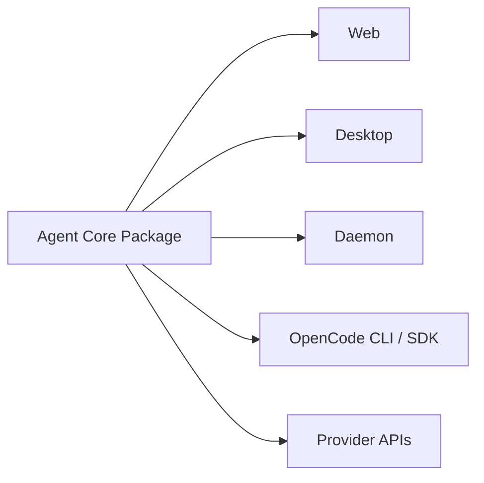

# Context View: Agent Core

**Date**: 2026-06-09
**Source ADRs**: ADR-001, ADR-002, ADR-003, ADR-004, ADR-005, ADR-006
**Status**: Generated from accepted ADRs

## Purpose

Agent Core is the shared TypeScript package used by desktop, daemon, web, and
MCP packaging flows. It defines shared contracts, storage, provider support,
daemon transports, OpenCode configuration, and reusable factories.

## External Entities

| Entity | Type | Relationship |
|--------|------|--------------|
| Web Package | Local consumer | Imports common types for renderer state and API shapes |
| Desktop Package | Local consumer | Imports desktop-main and common contracts |
| Daemon Package | Local consumer | Uses storage, task manager, daemon RPC, and OpenCode support |
| OpenCode CLI / SDK | External dependency | Receives generated config and runtime integration |
| Provider SDKs / APIs | External dependencies | Used for provider validation and model discovery |

## Context Diagram

## Constraints

Agent Core is ESM and must preserve `.js` extensions on internal imports. Shared
types in `common` and `desktop-main` are authoritative for cross-process
contracts. Core code must not become a UI or shell implementation layer.
