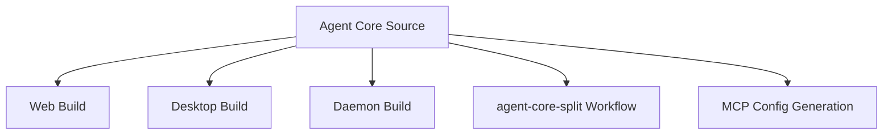

# Deployment View: Agent Core

**Date**: 2026-06-09
**Source ADRs**: ADR-001, ADR-002, ADR-003, ADR-004, ADR-005, ADR-006
**Status**: Generated from accepted ADRs

## Purpose

Agent Core is not deployed as an independent service. It is bundled into the
desktop and daemon runtime artifacts and supplies shared code to workspace
consumers.

## Runtime Environments

| Runtime | Consumption Mode |
|---------|------------------|
| Web Build | Type imports and shared common contracts |
| Desktop Build | Desktop-main exports and shared contracts |
| Daemon Build | Storage, providers, daemon RPC, task manager, OpenCode support |
| MCP Packaging | Tool-package metadata and generated MCP configuration support |
| Agent-Core Split | Downstream subtree distribution workflow |

## Deployment Topology

## Deployment Constraints

Agent Core exports must remain compatible with all local consumers. Packaging
must include any runtime files needed by daemon, providers, OpenCode config, and
MCP tool resolution.
