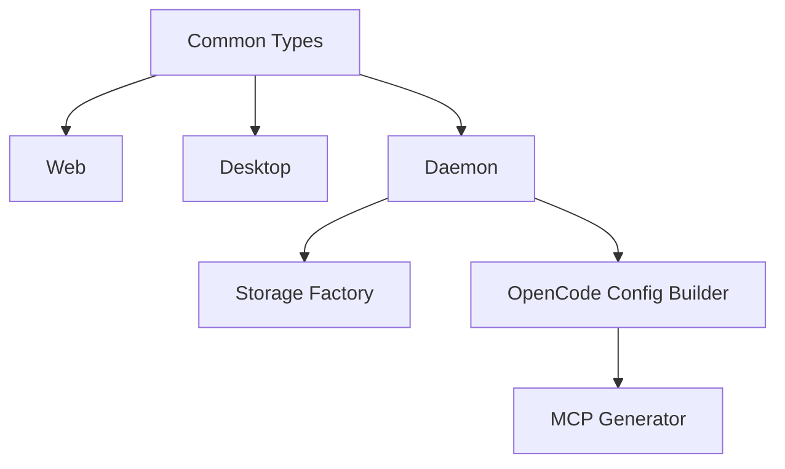

# Functional View: Agent Core

**Date**: 2026-06-09
**Source ADRs**: ADR-001, ADR-002, ADR-003, ADR-004, ADR-005, ADR-006
**Status**: Generated from accepted ADRs

## Purpose

Agent Core supplies shared implementation and contracts used by web, desktop,
daemon, and MCP packaging flows. It is the source of truth for cross-process
types and reusable runtime construction.

## Functional Elements

| Element | Responsibility |
|---------|----------------|
| Common Types | Define task, daemon, provider, storage, and renderer-facing shapes |
| Daemon Client / Server | Provide JSON-RPC transports and typed method contracts |
| Storage Factory | Creates sql.js storage, repositories, migrations, and secure storage methods |
| Provider Layer | Validates provider settings and resolves models/configuration |
| OpenCode Config Builder | Generates OpenCode config, auth sync, MCP entries, and CLI resolution |
| Task Manager Factory | Coordinates task execution, permissions, messages, and status events |
| MCP Generator | Builds first-party and remote MCP server definitions |

## Interaction Diagram

## Functional Boundaries

Agent Core must stay UI-agnostic and shell-agnostic. It defines contracts and
runtime primitives, while daemon and desktop own process-specific orchestration.
