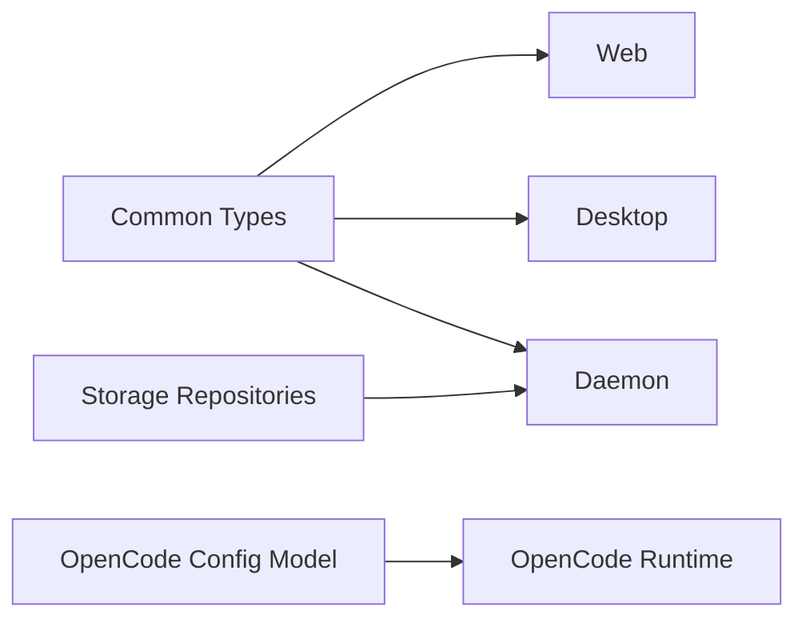

# Information View: Agent Core

**Date**: 2026-06-09
**Source ADRs**: ADR-001, ADR-002, ADR-003, ADR-004, ADR-005, ADR-006
**Status**: Generated from accepted ADRs

## Purpose

Agent Core defines the information contracts and persistence primitives consumed
by other sub-systems. It is the authoritative type source for task, daemon,
provider, storage, and OpenCode configuration shapes.

## Information Elements

| Element | Description |
|---------|-------------|
| Common Types | Shared TypeScript contracts for cross-process payloads |
| Daemon Method Map | Typed RPC method and notification schema |
| Storage Repositories | Task, message, settings, workspace, connector, and favorite access |
| Migration Definitions | Schema version changes with tested `up` and `down` paths |
| Secure Storage Schema | Encrypted key/value store for secrets |
| OpenCode Config Model | Provider, MCP, environment, auth, and system prompt configuration |

## Data Flow

## Information Constraints

Agent Core contracts must remain stable enough for web, desktop, and daemon to
compile together. Breaking cross-process changes require synchronized updates and
tests in the affected workspaces.
