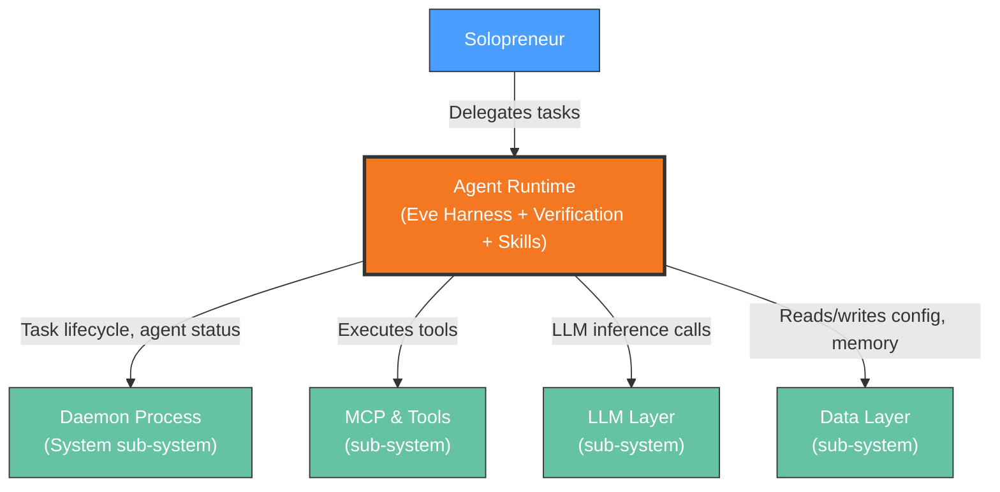

# Context View: Agent Runtime

**Sub-System**: Agent Runtime
**ADRs Referenced**: ADR-002, ADR-005, ADR-009
**Generated**: 2026-06-24

---

## 3.1 Context View

**Purpose**: Define system scope and external interactions for agent execution

### 3.1.1 System Scope

The Agent Runtime sub-system manages the lifecycle of specialized AI agents (Orchestrator, Secretary, Accountant). It owns agent materialization via the Eve harness (ADR-002), task verification via the 3-tier loop + CompletionEnforcer state machine (ADR-005), and the Skill & Knowledge System (Skill Workshop, Memory, Standing Orders via ADR-009). Agents execute tasks using tools provided by MCP & Tools and LLM calls via the LLM Layer.

### 3.1.2 Stakeholders

| Stakeholder | Role | Key Concerns | Priority |
|-------------|------|--------------|----------|
| Solopreneur (End User) | Delegates tasks to agents | Task completion rate, accuracy, agent responsiveness | High |
| Agent Developer | Creates/configures agent definitions | Extensibility, debugging, agent behavior predictability | Medium |

### 3.1.3 External Entities

| Entity | Type | Interaction Type | Data Exchanged | Protocols |
|--------|------|------------------|----------------|-----------|
| Daemon (System sub-system) | Internal process | JSON-RPC over Unix socket | Task requests, agent status, tool results | JSON-RPC |
| MCP & Tools (sub-system) | Internal process | stdio MCP transport | Tool calls, file operations, connector auth | MCP/stdin-stdout |
| LLM Layer (sub-system) | Internal service | ProviderClient abstraction | Prompt/response, model config | In-method call |
| Data Layer (sub-system) | Internal service | SQLite queries | Agent config, memory, skill definitions, task history | In-method call |

### 3.1.4 Context Diagram

### 3.1.5 External Dependencies

| Dependency | Purpose | SLA Expectations | Fallback Strategy |
|------------|---------|------------------|-------------------|
| Daemon IPC | Task dispatch, agent lifecycle, result delivery | Sub-second (local socket) | Reconnection with exponential backoff |
| MCP Tools | All tool execution (filesystem, email, calendar) | Varies per tool | Graceful degradation if MCP server unavailable |
| LLM Provider | Agent reasoning and generation | Provider-dependent | Retry with alternative model if configured |

---

## Perspective Considerations

### Security Considerations

Per-agent tool sandboxing via MCP assignments (join table `agent_mcp_assignments`). Honesty policy injected into every agent's `instructions.md`. CompletionEnforcer prevents hallucinated task completion claims via todo validation. HITL triggers for sensitive agent actions (ADR-005).

_Source ADRs: ADR-002, ADR-005, ADR-008_

### Performance Considerations

Deterministic routing (Tier 1) handles ~60% of common intents without LLM calls. Eve materialization adds 50-100ms to agent startup. Continuation nudges consume additional LLM tokens. TaskInactivityWatchdog enforces 150s hard timeout (ADR-005).

_Source ADRs: ADR-002, ADR-005_

---

**Validation Checklist**:
- [x] System appears as exactly ONE node
- [x] No internal databases shown
- [x] No internal services shown beyond context
- [x] All entities are either stakeholders OR external systems
- [x] All connections cross the system boundary
- [x] **Mermaid Only**: All architectural diagrams use Mermaid syntax
