# Deployment View: Agent Runtime

**Sub-System**: Agent Runtime
**ADRs Referenced**: ADR-002, ADR-005, ADR-009
**Generated**: 2026-06-24
**Dependencies**: Context View, Functional View

---

## 3.6 Deployment View

**Purpose**: Physical environment — nodes, networks, storage for agent execution

### 3.6.1 Runtime Environments

| Environment | Purpose | Infrastructure | Scale |
|-------------|---------|----------------|-------|
| User Desktop | Agent execution (production) | Daemon process (Node.js) | Single user |
| CI | Agent simulation tests | GitHub Actions | Ephemeral |

### 3.6.2 Network Topology

```mermaid
graph TB
    subgraph "Daemon Process"
        subgraph "Agent Runtime"
            Router["Deterministic Router"]
            Materializer["Agent Materializer"]
            Eve["Eve Runtime"]
            Enforcer["CompletionEnforcer"]
        end

        subgraph "Knowledge System"
            Workshop["Skill Workshop"]
            Memory["Memory System"]
            Standing["Standing Orders"]
        end
    end

    subgraph "File System Storage"
        AgentFiles["agents/{slug}/<br/>Eve generated files"]
        SkillFiles["skills/*.md<br/>User skills"]
        StandingFiles["standing-orders/*.md"]
    end

    subgraph "SQLite Storage"
        AgentDef["agents table"]
        Tasks["tasks + task_todos"]
        Conversations["conversations + messages"]
        MemoryEntries["memory_entries"]
        Proposals["skill_proposals"]
    end

    subgraph "External"
        MCP["MCP & Tools<br/>(sub-system)"]
        LLM["LLM Layer<br/>(sub-system)"]
    end

    Router --> Eve
    Materializer -->|"Generates"| AgentFiles
    Eve -->|"Tool calls"| MCP
    Eve -->|"LLM calls"| LLM
    Eve -->|"Task result"| Enforcer
    Eve -->|"Reads"| AgentDef
    Eve -->|"Writes"| Conversations
    Workshop -->|"Reads/writes"| SkillFiles
    Workshop -->|"Metadata"| Proposals
    Memory -->|"Stores"| MemoryEntries
    Standing -->|"Loads"| StandingFiles

    classDef runtimeNode fill:#f47721,stroke:#333,stroke-width:2px,color:#fff
    classDef fsNode fill:#66c2a5,stroke:#333,stroke-width:2px,color:#fff
    classDef sqliteNode fill:#8da0cb,stroke:#333,stroke-width:2px,color:#fff
    classDef externalNode fill:#e0e0e0,stroke:#333,stroke-width:1px

    class Router,Materializer,Eve,Enforcer,Workshop,Memory,Standing runtimeNode
    class AgentFiles,SkillFiles,StandingFiles fsNode
    class AgentDef,Tasks,Conversations,MemoryEntries,Proposals sqliteNode
    class MCP,LLM externalNode
```

### 3.6.3 Hardware Requirements

| Component | CPU | Memory | Storage | Notes |
|-----------|-----|--------|---------|-------|
| Agent Materialization | Low (occasional) | ~10MB per materialization | ~1MB per generated agent | Triggered on demand |
| Eve Runtime (per agent) | Moderate (LLM-bound) | ~50MB per running agent | — | Peak during task execution |
| Skill Workshop | Low (on demand) | ~5MB (LLM scan call) | ~10KB per SKILL.md | Occasional |
| Memory System | Low (background) | ~20MB (consolidation) | Variable (grows with use) | Nightly consolidation runs |

### 3.6.4 Third-Party Services

None — all agent runtime components run locally within the daemon process.

---

## Perspective Considerations

### Security Considerations

Agent files on disk are plaintext TypeScript — inspectable and auditable. Memory entries exclude sensitive data. Skill proposals security-scanned before apply. Agent definitions stored in SQLite with foreign key constraints. Standing orders are plaintext markdown files (ADR-002, ADR-005, ADR-009).

_Source ADRs: ADR-002, ADR-005, ADR-009_

### Performance Considerations

Agent materialization adds 50-100ms startup. Routing (Tiers 1-2) handles ~60% without LLM. Continuation nudges consume additional LLM tokens (BYOK). Max 10 continuations prevents runaway costs. Watchdog timeouts prevent hung agents (ADR-002, ADR-005).

_Source ADRs: ADR-002, ADR-005_

---

**ADR Traceability:**

| ADR | Decision | Impact on Deployment View |
|-----|----------|----------------------------|
| ADR-002 | Eve Agent Harness | Defines agent file storage, materialization deployment |
| ADR-005 | CompletionEnforcer | Defines task state storage, watchdog timeouts |
| ADR-009 | Skill & Knowledge | Defines skill files, memory storage, standing orders |
