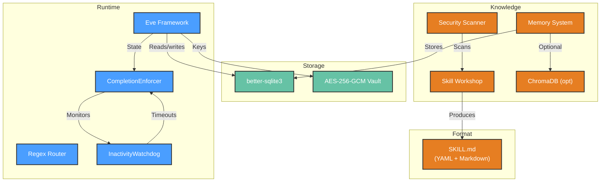

# Development View: Agent Runtime

**Sub-System**: Agent Runtime
**ADRs Referenced**: ADR-002, ADR-005, ADR-009
**Generated**: 2026-06-24
**Dependencies**: Functional View

---

## 3.5 Development View

**Purpose**: Constraints for developers — code organization, dependencies, testing for agent execution

### 3.5.1 Code Organization

```text
packages/agent-core/src/
├── eve/
│   ├── materializer.ts       # AgentMaterializer — generates Eve project files
│   ├── runtime-manager.ts    # Manages agent process lifecycle
│   └── templates/            # Eve project file templates
├── services/
│   ├── filesystem-service.ts # Deterministic routing: Tier 1
│   ├── todo-service.ts       # Deterministic routing: Tier 2
│   ├── completion-enforcer.ts# State machine (6 states)
│   ├── inactivity-watchdog.ts# TaskInactivityWatchdog
│   └── continuation-nudge.ts # Nudge generator
├── knowledge/
│   ├── skill-workshop.ts     # Proposal lifecycle
│   ├── security-scanner.ts   # Pre-apply scan
│   ├── memory-system.ts      # Extraction, consolidation, retrieval
│   └── standing-orders.ts    # Standing orders management
├── common/
│   └── types/                # Cross-process type contracts
└── storage/                  # SQLite + vault (shared with other subsystems)
```

### 3.5.2 Technology Stack Mapping

| Functional Role | Technology Choice | Version/Variant | ADR Reference |
|-----------------|-------------------|-----------------|---------------|
| Agent Runtime | Eve framework (generated) | v0.12.0 | ADR-002 |
| Agent Materialization | TypeScript file generation | — | ADR-002 |
| Deterministic Routing | Regex-based intent classification | — | ADR-002 |
| CompletionEnforcer | TypeScript state machine | 6 states | ADR-005 |
| Content Databases | SQLite (via better-sqlite3) | — | ADR-004 |
| Memory Vector Search | ChromaDB (optional, gated) | — | ADR-009 |
| Skill Format | Markdown + YAML frontmatter | SKILL.md | ADR-003, ADR-009 |

### 3.5.3 Technology Architecture



### 3.5.4 Module Dependencies

- `agent-materializer` depends on `eve/templates` and `storage/`
- `completion-enforcer` depends on `services/todo-service` (for todo validation)
- `skill-workshop` depends on `services/llm` (for proposal generation)
- `memory-system` depends on `storage/sqlite` and optionally `chromadb`
- All modules depend on `common/types/`

### 3.5.5 Build & CI/CD

- **Build System**: Built as part of `@myboteam/agent-core` package via tsup
- **CI Pipeline**: CompletionEnforcer state machine tests (exhaustive) → unit tests → memory system integration tests → skill workshop simulation tests
- **Testing**: Mock LLM provider for simulation tests; in-memory SQLite for storage tests

### 3.5.6 Development Standards

- CompletionEnforcer state transitions MUST be tested exhaustively (all 6 states, all valid transitions)
- Memory extraction LLM calls mocked in tests (canned responses)
- Skill security scanner tested with known-good and known-bad proposals
- Migration tests (up + down) required for any storage schema change

---

## Perspective Considerations

### Security Considerations

Skill scanning before apply prevents malicious content injection. Rollback metadata for all skill changes. Memory extraction filters sensitive data. Agent instructions include honesty policy (ADR-005, ADR-009).

_Source ADRs: ADR-005, ADR-009_

### Performance Considerations

Eve materialization 50-100ms. Memory retrieval <500ms (SQLite) or <2s (ChromaDB). Continuation nudges consume LLM tokens. Max 10 continuations before MAX_RETRIES_REACHED (ADR-005).

_Source ADRs: ADR-002, ADR-005, ADR-009_

---

**ADR Traceability:**

| ADR | Decision | Impact on Development View |
|-----|----------|----------------------------|
| ADR-002 | Eve Agent Harness | Defines materializer, runtime, template structure |
| ADR-005 | CompletionEnforcer | Defines state machine, watchdog, nudge generator |
| ADR-009 | Skill & Knowledge | Defines workshop, scanner, memory, standing orders |
