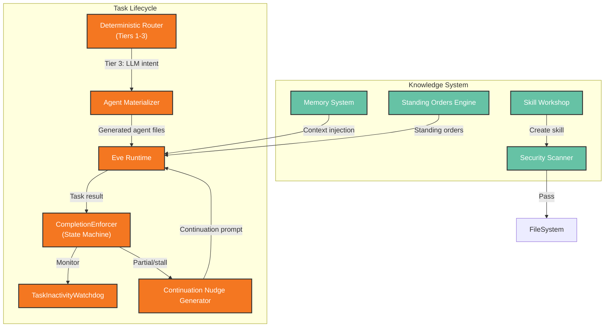

# Functional View: Agent Runtime

**Sub-System**: Agent Runtime
**ADRs Referenced**: ADR-002, ADR-005, ADR-009
**Generated**: 2026-06-24
**Dependencies**: Context View

---

## 3.2 Functional View

**Purpose**: Describe functional elements, responsibilities, and interactions for agent execution

### 3.2.1 Functional Elements

| Element | Responsibility | Interfaces Provided | Dependencies |
|---------|----------------|---------------------|--------------|
| Agent Materializer | Generates deterministic Eve project files on disk | `materialize(slug)` → agent files | SQLite (AgentDefinition), Daemon |
| Eve Runtime | Executes agent loop: prompt → tool calls → response | `runAgent(agentId, task)` | Materializer, LLM Provider, Tools |
| Deterministic Router | Regex-based intent classification for direct services | Tiers 1-3 routing | FilesystemService, TodoService |
| CompletionEnforcer | State machine for task lifecycle with recovery | 6 states (IDLE → DONE/MAX_RETRIES) | TaskInactivityWatchdog |
| TaskInactivityWatchdog | Monitors SDK event stream for stalls | Soft/hard timeout enforcement | CompletionEnforcer |
| Skill Workshop | Proposal lifecycle for user-created skills | create → pending → apply/reject/quarantine | SQLite, LLM, Security Scanner |
| Security Scanner | Pre-apply scan for malicious skill content | LLM-based scan → quarantine/pass | LLM Provider |
| Memory System | Persistent categorized memory with extraction/consolidation | CRUD, search, FTS5 | SQLite, ChromaDB (optional) |
| Standing Orders Engine | Persistent agent instructions as workspace files | Create, list, edit, pause, remove | File System |
| Continuation Nudge Generator | Targeted prompts from incomplete work state | `generateNudge(state)` → prompt | CompletionEnforcer |
| Agent Status Manager | Tracks agent lifecycle: idle → materialized → running → stopped → error | Status transitions, health check | Eve Runtime |

### 3.2.2 Element Interactions

### 3.2.3 Functional Boundaries

**What this system DOES:**

- Route intents deterministically: filesystem → FilesystemService, todos → TodoService, other → LLM
- Materialize Eve agent files on disk from SQLite definitions
- Execute agent loops with tool execution and provider calls
- Verify task results via 6-state CompletionEnforcer (incl. auto-continuation on partial/stall)
- Create user skills via proposal lifecycle (create → pending → apply/reject/quarantine/revise)
- Extract, store, and retrieve categorized memory from conversations
- Manage standing orders as persistent agent instructions

**What this system does NOT do:**

- Does NOT execute tools directly (delegates to MCP & Tools)
- Does NOT make direct LLM provider calls (delegates to LLM Layer)
- Does NOT store structured data directly (delegates to Data Layer)
- Does NOT render UI (delegates to Web/Shell)
- Does NOT handle file I/O outside workspace boundaries

---

## Perspective Considerations

### Security Considerations

Per-agent tool sandboxing via MCP assignments. Honesty policy + tool honesty injected into every agent `instructions.md`. CompletionEnforcer prevents hallucinated success claims via todo validation. Skill security scanning auto-quarantines dangerous proposals. Rollback metadata for all skill changes (ADR-005, ADR-009).

_Source ADRs: ADR-002, ADR-005, ADR-009_

### Performance Considerations

Deterministic routing (Tiers 1-2) handles ~60% without LLM calls. Eve materialization adds 50-100ms. Continuation nudges consume LLM tokens (user pays BYOK). Max 10 continuations before MAX_RETRIES_REACHED. TaskInactivityWatchdog: 90s soft + 60s grace = 150s hard timeout (ADR-002, ADR-005).

_Source ADRs: ADR-002, ADR-005_

### Evolution Considerations

Adding new agent = SQLite record + materialize (no core changes). Skill Workshop enables user-driven agent evolution without code changes. Memory consolidation runs nightly. Standing orders grow with usage — needs prompt budget management (ADR-009).

_Source ADRs: ADR-009_

### Usability Considerations

Skill Workshop: users say "make a skill from what we just did" — zero configuration UI. Standing Orders: "always X" pattern. Memory extracted automatically from conversation — users never manually configure. Continuation nudges transparently recover stalled tasks (ADR-005, ADR-009).

_Source ADRs: ADR-005, ADR-009_

---

## Validation Checklist

- [x] **Technology Neutrality**: All elements described by architectural role
- [x] **Diagram Consistency**: Mermaid diagram uses generic labels
- [x] **Interface Abstraction**: Interfaces describe capabilities
- [x] **Complete Coverage**: All major functional responsibilities represented
- [x] **Clear Boundaries**: Boundary rules clearly defined

---

**ADR Traceability:**

| ADR | Decision | Impact on Functional View |
|-----|----------|---------------------------|
| ADR-002 | Eve Agent Harness | Defines Materializer, Eve Runtime, Deterministic Router |
| ADR-005 | Verification + CompletionEnforcer | Defines Enforcer, Watchdog, Nudge Generator |
| ADR-009 | Skill & Knowledge System | Defines Workshop, Scanner, Memory, Standing Orders |
