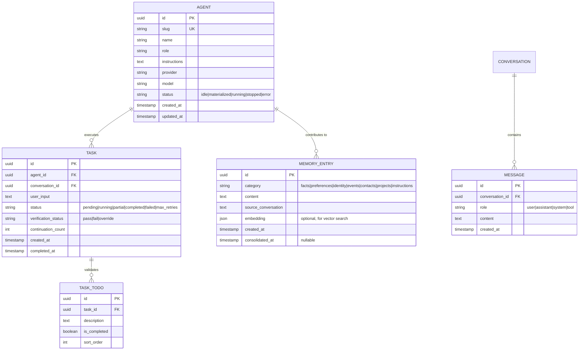

# Information View: Agent Runtime

**Sub-System**: Agent Runtime
**ADRs Referenced**: ADR-002, ADR-005, ADR-009
**Generated**: 2026-06-24
**Dependencies**: Functional View

---

## 3.3 Information View

**Purpose**: Describe data storage, management, and flow for agent execution

### 3.3.1 Data Entities

| Entity | Storage Location | Owner Component | Lifecycle | Access Pattern |
|--------|------------------|-----------------|-----------|----------------|
| AgentDefinition | SQLite (agents) | Agent Materializer | Create → Update → Archive | Read-heavy (at materialization) |
| Task | SQLite (tasks) | CompletionEnforcer | Create → Execute → Complete/Fail | Write-once, read-status |
| Task Todo | SQLite (task_todos) | CompletionEnforcer | Create → Update → Complete | Write-many, read-status |
| Conversation | SQLite (conversations) | Eve Runtime | Append-only | Write-append, read-history |
| Message | SQLite (messages) | Eve Runtime | Append-only | Write-append, read-history |
| Delegation | SQLite (delegations) | Orchestrator | Create → Execute → Complete | Write-once |
| Memory Entry | SQLite (memory_entries) | Memory System | Extract → Store → Consolidate → Archive | Read-heavy (session start) |
| Skill Proposal | SQLite (skill_proposals) | Skill Workshop | Create → Pending → Apply/Reject/Quarantine | Write-once, read-status |
| Skill Version | SQLite (skill_versions) | Skill Workshop | Append-only (rollback metadata) | Write-once |
| Standing Order | File System (`{dataDir}/standing-orders/`) | Standing Orders Engine | Create → Edit → Pause → Remove | Read-heavy (session start) |
| SKILL.md | File System (`{dataDir}/skills/`) | Skill Workshop | Create → Apply → Rollback | Read-heavy (session start) |

### 3.3.2 Data Model

### 3.3.3 Data Flow

**Key Data Flows:**

1. **Task Execution Flow**: User input → Deterministic Router classifies → If LLM intent: task created in pending → Agent materialized → Eve executes with conversation history → Tool calls logged → Output sanitized → CompletionEnforcer validates → DONE or continuation nudged
2. **Memory Extraction Flow**: Conversation turn completed → Background task reads last N messages → LLM extracts structured memory entries → Written to memory_entries table → Nightly consolidation merges duplicates
3. **Skill Creation Flow**: User says "make a skill" → Proposal created (pending) → Security scanner analyzes → If pass: user notified for approval → On apply: SKILL.md written, rollback metadata stored → If fail: quarantined

### 3.3.4 Data Quality & Integrity

- **Consistency Model**: Strong (SQLite ACID)
- **Validation Rules**: Task status transitions enforced by CompletionEnforcer state machine; messages append-only; cascading deletes (conversation → messages)
- **Retention Policy**: Conversations retained indefinitely (no auto-delete); memory entries consolidated nightly; skill version history kept for rollback
- **Backup Strategy**: Covered by Data Layer backup (SQLite + file system)

---

## Perspective Considerations

### Security Considerations

Agent instructions include honesty policy to prevent data fabrication. Skill proposals security-scanned before apply. Rollback metadata enables reverting malicious skills. Memory entries exclude sensitive data (filtered at extraction). Task results include verification status for audit trail (ADR-005, ADR-009).

_Source ADRs: ADR-005, ADR-009_

### Performance Considerations

Conversation history grows with usage — needs prompt budget management at injection time. Memory retrieval at session start adds <500ms (SQLite) or <2s (ChromaDB optional). Skill proposal scans add 1-2 LLM calls. CompletionEnforcer continuation nudges add additional LLM token consumption (ADR-005, ADR-009).

_Source ADRs: ADR-005, ADR-009_

---

**ADR Traceability:**

| ADR | Decision | Impact on Information View |
|-----|----------|----------------------------|
| ADR-002 | Eve Agent Harness | Defines Agent, Conversation, Message, Delegation entities |
| ADR-005 | CompletionEnforcer | Defines Task, TaskTodo entities with state machine statuses |
| ADR-009 | Skill & Knowledge | Defines MemoryEntry, SkillProposal, SkillVersion entities |
