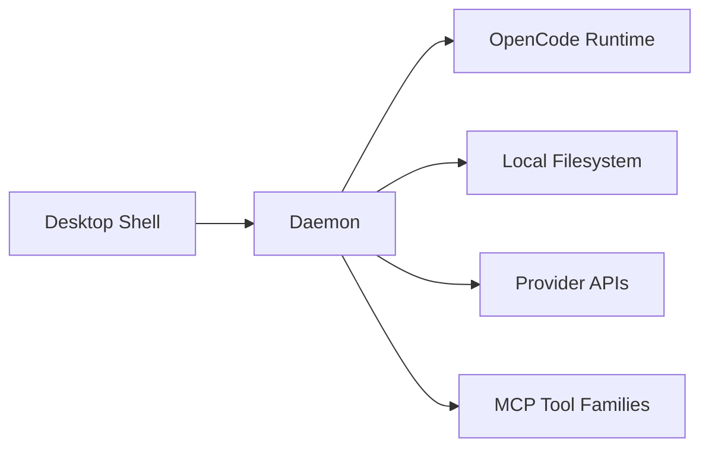

# Context View: Daemon

**Date**: 2026-06-09
**Source ADRs**: ADR-001, ADR-002, ADR-003, ADR-004, ADR-005
**Status**: Generated from accepted ADRs

## Purpose

The Daemon sub-system is the long-lived local background service. It owns task
execution, storage access, secrets, provider settings, connector domain logic,
token lifecycle, and task-event fan-out.

## External Entities

| Entity | Type | Relationship |
|--------|------|--------------|
| Desktop Shell | Local sub-system | Connects to daemon over local JSON-RPC transport |
| OpenCode Runtime | Local child process | Executes one active task per server runtime |
| Local Filesystem | OS resource | Stores database, encrypted secrets, logs, and task artifacts |
| Provider APIs | External APIs | Used through task/provider configuration |
| MCP Tools | Local sub-systems | Exposed to OpenCode runtime through generated config |

## Context Diagram

## Constraints

Daemon APIs remain local-only. Socket RPC and any local HTTP endpoint must treat
payloads as untrusted, validate inputs, and authenticate HTTP access. Recovery is
best-effort after daemon crashes; reconnect to a live daemon is supported.
