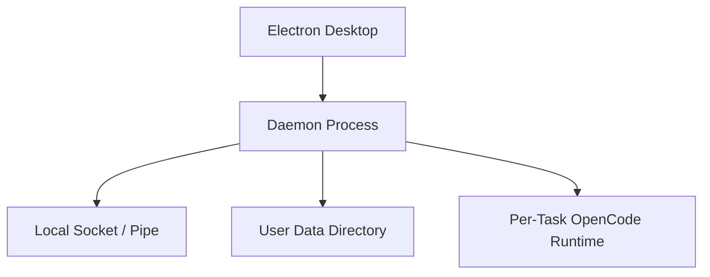

# Deployment View: Daemon

**Date**: 2026-06-09
**Source ADRs**: ADR-001, ADR-002, ADR-003, ADR-004, ADR-005
**Status**: Generated from accepted ADRs

## Purpose

The Daemon deploys as a bundled Node.js process launched by the Electron shell.
It is local-only and communicates with desktop through local transport.

## Runtime Environments

| Runtime | Description |
|---------|-------------|
| Development Daemon | `tsx` or built daemon started by desktop dev scripts |
| Packaged Daemon | `apps/daemon/dist` staged into desktop resources |
| Local Socket / Pipe | Same-user JSON-RPC transport |
| Local HTTP Helpers | Localhost-only endpoints requiring auth and validation |
| OpenCode Child Processes | Per-task local `opencode serve` runtimes |
| Data Directory | Stores database, encrypted secrets, logs, pid/socket files |

## Deployment Topology

## Deployment Constraints

Daemon runtime must bind only locally. HTTP helpers require authentication.
Daemon crash recovery is best-effort; active task resume after daemon crash is
not guaranteed.
