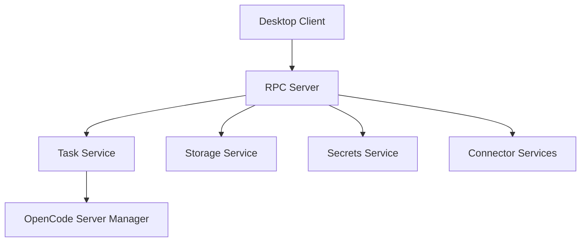

# Functional View: Daemon

**Date**: 2026-06-09
**Source ADRs**: ADR-001, ADR-002, ADR-003, ADR-004, ADR-005
**Status**: Generated from accepted ADRs

## Purpose

The Daemon sub-system performs privileged and long-lived background work. It is
the owner of task execution, storage, secrets, connector domain logic, token
lifecycle, provider settings, and runtime event fan-out.

## Functional Elements

| Element | Responsibility |
|---------|----------------|
| RPC Server | Registers daemon methods and emits task/setting/connector events |
| Task Service | Starts, cancels, resumes, and tracks user tasks |
| OpenCode Server Manager | Creates one OpenCode server runtime per active task |
| Storage Service | Owns sql.js storage and migration-backed repositories |
| Secrets Service | Owns encrypted file access for keys and tokens |
| Connector Services | Own connector domain logic and token lifecycle |
| Settings / Provider Services | Persist provider configuration and model selections |

## Interaction Diagram

## Functional Boundaries

Each active task must have its own OpenCode runtime. Daemon APIs are local-only
and validate all IPC/RPC/HTTP payloads before privileged work. Crash recovery is
best-effort, not guaranteed active task resume.
