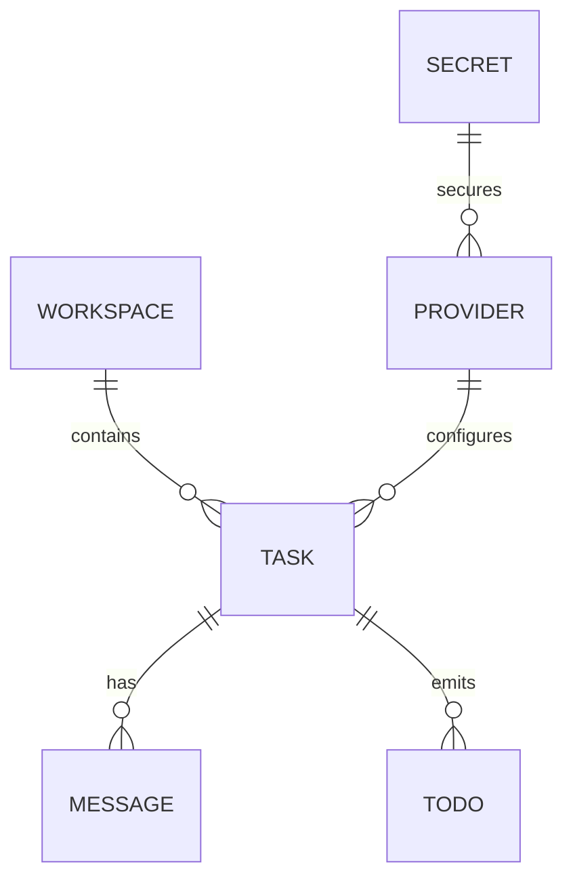

# Information View: Daemon

**Date**: 2026-06-09
**Source ADRs**: ADR-001, ADR-002, ADR-003, ADR-004, ADR-005
**Status**: Generated from accepted ADRs

## Purpose

The Daemon sub-system is the owner of durable local application information and
runtime task events. It persists relational state through agent-core storage and
secrets through encrypted file storage.

## Information Elements

| Element | Storage | Description |
|---------|---------|-------------|
| Tasks | sql.js | Task records, status, timestamps, workspace linkage |
| Messages | sql.js | Task conversation and tool/event messages |
| Settings | sql.js | Provider, model, close behavior, and app preferences |
| Workspaces | sql.js | Workspace paths and active workspace metadata |
| Secrets | Encrypted file | API keys, OAuth tokens, connector tokens |
| Runtime Events | Socket notifications | Task progress, auth errors, todos, summaries |

## Data Flow

## Information Constraints

Migrations require executable `up` and `down` paths with tests. Decrypted values
must not leak to renderer state, logs, traces, screenshots, or fixtures. Backup
and restore require an app-managed export/import flow.
