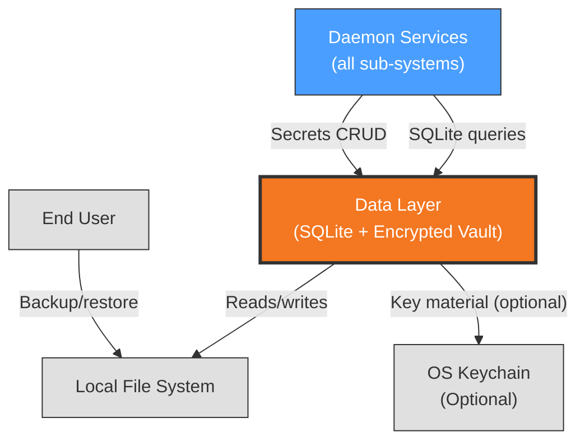

# Context View: Data Layer

**Sub-System**: Data Layer
**ADRs Referenced**: ADR-004
**Generated**: 2026-06-24

---

## 3.1 Context View

**Purpose**: Define system scope and external interactions for data storage

### 3.1.1 System Scope

The Data Layer sub-system provides persistent storage for all structured data (agents, tasks, conversations, settings, skills, memory, notes, document versions, schedules) and secrets (API keys, OAuth tokens, connector credentials). It uses better-sqlite3 in WAL mode for synchronous SQLite access and AES-256-GCM encrypted vault file for secrets. All data stays on the user's machine with no cloud sync.

### 3.1.2 Stakeholders

| Stakeholder | Role | Key Concerns | Priority |
|-------------|------|--------------|----------|
| Daemon Process | Primary data consumer/source | Read/write performance, data integrity, migration safety | High |
| End User | Data owner | Privacy, data portability, backup | Critical |
| System Administrator | Manages data directory | Portability, crash recovery | Medium |

### 3.1.3 External Entities

| Entity | Type | Interaction Type | Data Exchanged | Protocols |
|--------|------|------------------|----------------|-----------|
| Daemon Services | Internal | In-method SQLite queries | All structured data | better-sqlite3 API |
| OS Keychain (optional) | OS service | Keytar API | Encryption key material | Native OS keychain |
| File System (User Machine) | Local OS | File I/O | SQLite database file, encrypted vault file | POSIX/Windows API |

### 3.1.4 Context Diagram

### 3.1.5 External Dependencies

| Dependency | Purpose | SLA Expectations | Fallback Strategy |
|------------|---------|------------------|-------------------|
| Local File System | Database + vault file persistence | OS-native (no SLA) | WAL mode prevents corruption; PID lock prevents multi-instance |
| better-sqlite3 (native binary) | SQLite engine | Binary-dependent | `@electron/rebuild` during packaging handles native rebuild |
| OS Keychain (optional) | Encryption key storage | OS-native | Falls back to machine-derived key (platform + homedir + username) |

---

## Perspective Considerations

### Security Considerations

Secrets encrypted at rest with AES-256-GCM (PBKDF2, 100k iterations). Decrypted secrets never enter the renderer process, never appear in logs, screenshots, or test fixtures. Key prefix exposure only (last 4 chars) for UI identification. Atomic writes (temp file + rename) prevent vault corruption. PID lock file prevents daemon multi-instance (ADR-004).

_Source ADRs: ADR-004_

### Performance Considerations

Synchronous SQLite reads are fast and predictable. WAL mode enables concurrent reads. Key derivation is CPU-intensive on first unlock (~100ms). better-sqlite3 chosen over sql.js for better synchronous performance (ADR-004).

_Source ADRs: ADR-004_

---

**Validation Checklist**:
- [x] System appears as exactly ONE node
- [x] No internal databases shown
- [x] No internal services shown beyond context
- [x] All entities are either stakeholders OR external systems
- [x] All connections cross the system boundary
- [x] **Mermaid Only**: All architectural diagrams use Mermaid syntax
