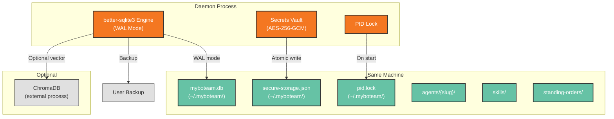

# Deployment View: Data Layer

**Sub-System**: Data Layer
**ADRs Referenced**: ADR-004
**Generated**: 2026-06-24
**Dependencies**: Context View, Functional View

---

## 3.6 Deployment View

**Purpose**: Physical environment — nodes, networks, storage for data persistence

### 3.6.1 Runtime Environments

| Environment | Purpose | Infrastructure | Scale |
|-------------|---------|----------------|-------|
| User Desktop | Production data storage | Daemon process (SQLite in-process) | Single user |
| CI | Storage testing | In-memory SQLite (temp) | Ephemeral per test |

### 3.6.2 Network Topology

### 3.6.3 Hardware Requirements

| Component | CPU | Memory | Storage | Notes |
|-----------|-----|--------|---------|-------|
| SQLite Engine | Minimal | ~10MB (WAL shared buffer) | Variable (DB grows with usage) | WAL mode configured |
| Secrets Vault | Low (on unlock) | ~5MB (decrypted in-memory) | ~10KB (typical) | Key derivation ~100ms on first unlock |
| ChromaDB (optional) | Moderate (on query) | ~200MB baseline | Variable | Optional gated feature |

### 3.6.4 Third-Party Services

None — all storage is local-only, no cloud dependency.

---

## Perspective Considerations

### Security Considerations

Data directory at `~/.myboteam/` with filesystem permissions. Vault uses AES-256-GCM + PBKDF2 (100k iterations). Atomic vault writes (temp + rename) prevent corruption. PID lock prevents multi-instance corruption. Sensitive paths blocked by denylist (`.ssh`, `.env`, etc.) (ADR-004).

_Source ADRs: ADR-004_

### Performance Considerations

SQLite WAL mode enables concurrent reads while writing. Key derivation CPU-intensive on first unlock (cached thereafter). In-memory SQLite for tests (not production). ChromaDB (optional) adds external process dependency (ADR-004).

_Source ADRs: ADR-004_

### Availability Considerations

SQLite WAL mode provides crash recovery. PID lock prevents multi-instance. Data directory portable for backup. No cloud dependency means no external downtime. better-sqlite3 synchronous API means no connection pool management needed (ADR-004).

_Source ADRs: ADR-004_

---

**ADR Traceability:**

| ADR | Decision | Impact on Deployment View |
|-----|----------|----------------------------|
| ADR-004 | better-sqlite3 + AES-256-GCM vault | Defines all storage deployment: file locations, engines, security model |
