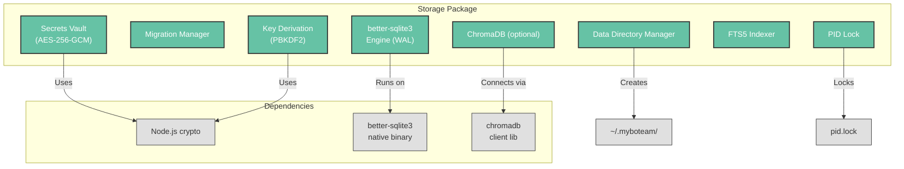

# Development View: Data Layer

**Sub-System**: Data Layer
**ADRs Referenced**: ADR-004
**Generated**: 2026-06-24
**Dependencies**: Functional View

---

## 3.5 Development View

**Purpose**: Constraints for developers — code organization, dependencies, testing for data storage

### 3.5.1 Code Organization

```text
packages/agent-core/src/storage/
├── database.ts             # SQLite engine (better-sqlite3), WAL mode config
├── migrations/
│   ├── 001_init.ts         # Immutable released migrations
│   ├── 002_skills.ts
│   ├── 003_notes.ts
│   └── manager.ts          # Bidirectional migration runner
├── vault.ts                # AES-256-GCM encrypted vault (read/write/atomic rename)
├── key-derivation.ts       # PBKDF2 key derivation from machine identity
├── data-directory.ts       # Path resolution, directory init
├── pid-lock.ts             # PID lock file acquire/release
├── fts5.ts                 # FTS5 search index helpers
└── chromadb.ts             # Optional ChromaDB connector (gated by config)
```

### 3.5.2 Technology Stack Mapping

| Functional Role | Technology Choice | Version/Variant | ADR Reference |
|-----------------|-------------------|-----------------|---------------|
| SQLite Engine | better-sqlite3 | WAL mode, synchronous | ADR-004 |
| Encryption | AES-256-GCM (Node.js crypto) | 256-bit key, GCM mode | ADR-004 |
| Key Derivation | PBKDF2 | 100,000 iterations | ADR-004 |
| Full-Text Search | SQLite FTS5 | Built-in tokenizer | ADR-004 |
| Vector Search | ChromaDB (optional) | — | ADR-004, ADR-009 |
| Data Directory | OS-managed (`~/.myboteam/` or env var) | — | ADR-004 |

### 3.5.3 Technology Architecture



### 3.5.4 Module Dependencies

- `database.ts` depends on `better-sqlite3` (native binary, requires `@electron/rebuild`)
- `vault.ts` depends on Node.js `crypto` module (built-in)
- `key-derivation.ts` depends on Node.js `crypto` module
- `chromadb.ts` is an optional import (gated by config flag)
- All storage modules depend on `common/types/` for type contracts

### 3.5.5 Build & CI/CD

- **Build System**: Part of `@myboteam/agent-core` package, built via tsup
- **CI Pipeline**: Storage unit tests (in-memory SQLite) → migration tests (up + down) → vault encryption/decryption round-trip → integration tests with real SQLite (temp database per test)
- **Packaging**: `@electron/rebuild` step required for better-sqlite3 native binary

### 3.5.6 Development Standards

- NEVER use production `.local-data/myboteam.db` in tests — always use in-memory SQLite
- Each migration MUST have up + down functions
- Released migrations are immutable — never modify a released migration file
- Vault tests MUST test: encrypt → decrypt round-trip, corrupted data rejection, key derivation consistency
- PID lock tests MUST test: acquire, release, second instance detection

---

## Perspective Considerations

### Security Considerations

better-sqlite3 native binary requires `@electron/rebuild` — verified in CI. Vault encryption uses Node.js built-in crypto (no external lib). Key derivation from stable machine identity prevents key loss on platform change. Optional env var override for development (ADR-004).

_Source ADRs: ADR-004_

### Performance Considerations

In-memory SQLite for unit tests ensures fast test execution. Migration tests create temp databases per test — cleanup guaranteed. Vault key derivation tested once per suite (not per test). ChromaDB (optional) tested with mock client in CI (no real ChromaDB dependency) (ADR-004).

_Source ADRs: ADR-004_

---

**ADR Traceability:**

| ADR | Decision | Impact on Development View |
|-----|----------|----------------------------|
| ADR-004 | better-sqlite3 + AES-256-GCM | Defines all storage module structure, dependencies, testing standards |
