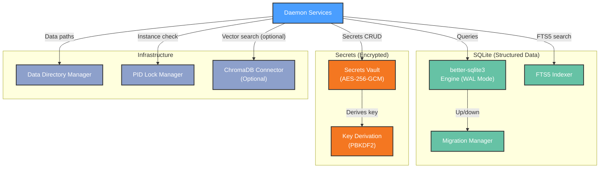

# Functional View: Data Layer

**Sub-System**: Data Layer
**ADRs Referenced**: ADR-004
**Generated**: 2026-06-24
**Dependencies**: Context View

---

## 3.2 Functional View

**Purpose**: Describe functional elements, responsibilities, and interactions for data storage

### 3.2.1 Functional Elements

| Element | Responsibility | Interfaces Provided | Dependencies |
|---------|----------------|---------------------|--------------|
| SQLite Engine (better-sqlite3) | Synchronous SQLite with WAL mode | Query execution, migrations | Native binary (`@electron/rebuild`) |
| Migration Manager | Bidirectional schema migrations (up + down) | `migrate(direction)`, `rollback(version)` | SQLite Engine |
| Secrets Vault | AES-256-GCM encrypted key-value storage | `get(key)`, `set(key, value)`, `has(key)` | File System (atomic writes) |
| Key Derivation Engine | PBKDF2 key derivation from machine identity | `deriveKey(platform, homedir, username)` | OS identity |
| Data Directory Manager | Manages `~/.myboteam/` or `.local-data/` structure | `init()`, `validate()`, `getPath(type)` | File System |
| PID Lock Manager | Prevents daemon multi-instance | `acquire()`, `release()`, `isLocked()` | File System (lock file) |
| FTS5 Indexer | Full-text search for notes and memory | Search index, tokenizer | SQLite Engine |
| ChromaDB Connector (optional) | Vector search for semantic memory retrieval | Embedding query, index management | ChromaDB (external, gated) |

### 3.2.2 Element Interactions

### 3.2.3 Functional Boundaries

**What this system DOES:**

- Store all structured data in SQLite with WAL mode for concurrent reads
- Manage bidirectional schema migrations (up + down) with test coverage
- Encrypt API keys and OAuth tokens with AES-256-GCM + PBKDF2
- Derive vault key from machine identity (platform + homedir + username)
- Manage data directory structure and runtime path resolution
- Prevent daemon multi-instance via PID lock file
- Provide FTS5 full-text search for notes and memory entries
- Optionally connect to ChromaDB for vector-based semantic search

**What this system does NOT do:**

- Does NOT execute agent logic or routing
- Does NOT manage IPC or process communication
- Does NOT cache data in-memory beyond SQLite's built-in cache
- Does NOT sync data to cloud or external services
- Does NOT expose decrypted secrets outside the daemon process

---

## Perspective Considerations

### Security Considerations

Secrets encrypted with AES-256-GCM at rest. Decrypted secrets never enter renderer, logs, screenshots, or test fixtures. Key prefix (last 4 chars) only exposed in UI for identification. Atomic write (temp + rename) prevents vault corruption. PID lock prevents daemon multi-instance. Immutable released migrations prevent schema corruption (ADR-004).

_Source ADRs: ADR-004_

### Performance Considerations

Synchronous SQLite: fast and predictable reads. WAL mode enables concurrent reader performance. Key derivation: ~100ms CPU on first unlock. FTS5 search: sub-100ms. ChromaDB (optional): adds 200-500ms for vector queries. better-sqlite3 chosen over sql.js for synchronous performance (ADR-004).

_Source ADRs: ADR-004_

### Evolution Considerations

All migrations are bidirectional + tested — safe rollbacks. Data directory is fully portable (backup/restore supported). Schema evolution via release train (immutable released migrations). ChromaDB is optional gate — system works with SQLite-only (ADR-004).

_Source ADRs: ADR-004_

---

## Validation Checklist

- [x] **Technology Neutrality**: All elements described by architectural role
- [x] **Diagram Consistency**: Mermaid diagram uses generic labels
- [x] **Interface Abstraction**: Interfaces describe capabilities
- [x] **Complete Coverage**: All storage responsibilities represented
- [x] **Clear Boundaries**: Boundary rules clearly defined

---

**ADR Traceability:**

| ADR | Decision | Impact on Functional View |
|-----|----------|---------------------------|
| ADR-004 | better-sqlite3 + AES-256-GCM vault | Defines all storage elements, engines, and security model |
