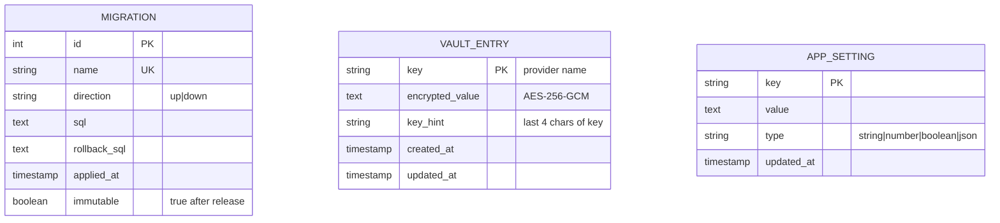

# Information View: Data Layer

**Sub-System**: Data Layer
**ADRs Referenced**: ADR-004
**Generated**: 2026-06-24
**Dependencies**: Functional View

---

## 3.3 Information View

**Purpose**: Describe data storage, management, and flow for data persistence

### 3.3.1 Data Entities

| Entity | Storage Location | Owner Component | Lifecycle | Access Pattern |
|--------|------------------|-----------------|-----------|----------------|
| SQLite Database (`myboteam.db`) | File System (`~/.myboteam/` or `.local-data/`) | SQLite Engine | Persistent, WAL mode | Read-write (all services) |
| Encrypted Vault (`secure-storage.json`) | File System (same directory) | Secrets Vault | Persistent, atomic writes | Write-rare, read-on-materialize |
| PID Lock File | File System (same directory) | PID Lock Manager | Ephemeral (per daemon instance) | Write-on-start, read-on-start |
| Agent Runtime Files | File System (`{dataDir}/agents/{slug}/`) | Eve Materializer | Regenerate on config change | Read-on-materialize |
| User Skills | File System (`{dataDir}/skills/`) | Skill Workshop | User-managed | Read-on-session-start |
| Standing Orders | File System (`{dataDir}/standing-orders/`) | Standing Orders Engine | User-managed | Read-on-session-start |
| ChromaDB (optional) | External process (if configured) | ChromaDB Connector | External (optional gated) | Query on memory retrieval |

### 3.3.2 Data Model

### 3.3.3 Data Flow

**Key Data Flows:**

1. **Migration Flow**: Daemon starts → Migration Manager checks current schema version → Applies pending migrations in order (up) → Logs each migration as immutable → On rollback: applies down migrations in reverse order
2. **Secrets Flow**: User enters API key via UI → UI sends to daemon via RPC → Daemon derives encryption key (PBKDF2) → Encrypts value (AES-256-GCM) → Writes to vault atomically (temp file + rename) → On agent materialization: decrypts in-memory, injects into Eve config, never persists decrypted value
3. **Data Directory Flow**: Daemon starts → Checks data directory exists → If not: creates directory structure → Acquires PID lock → If lock fails: exit with error (prevent multi-instance) → On shutdown: releases PID lock

### 3.3.4 Data Quality & Integrity

- **Consistency Model**: Strong (SQLite ACID), WAL mode for concurrent reads
- **Validation Rules**: Foreign keys enforced (ON); cascading deletes configured; PID lock prevents multi-instance corruption; atomic vault writes prevent partial write corruption
- **Retention Policy**: All data retained indefinitely (user-managed); no automatic deletion; portable data directory supports manual backup
- **Backup Strategy**: User backs up entire data directory (`~/.myboteam/`); vault + SQLite are the two persistent files

---

## Perspective Considerations

### Security Considerations

Secrets at rest: AES-256-GCM with PBKDF2 (100k iterations). Decrypted secrets: in-memory only, never in renderer/logs/test fixtures/traces. Key prefix exposure (last 4 chars) only. Atomic writes prevent vault corruption. PID lock prevents daemon multi-instance. Immutable migrations prevent schema corruption (ADR-004).

_Source ADRs: ADR-004_

### Performance Considerations

Synchronous SQLite: fast and predictable reads (<5ms typical). WAL mode: concurrent read performance. Key derivation: ~100ms CPU on first unlock. FTS5 search: sub-100ms. ChromaDB (optional): adds 200-500ms for vector queries. better-sqlite3 native binary requires `@electron/rebuild` during packaging (ADR-004).

_Source ADRs: ADR-004_

---

**ADR Traceability:**

| ADR | Decision | Impact on Information View |
|-----|----------|----------------------------|
| ADR-004 | better-sqlite3 + AES-256-GCM vault | Defines all storage entities, migration model, vault format |
