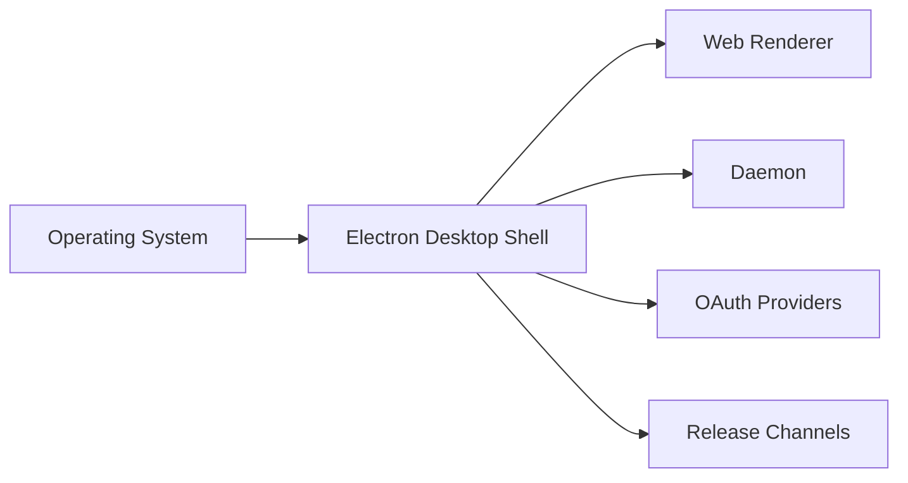

# Context View: Desktop

**Date**: 2026-06-09
**Source ADRs**: ADR-001, ADR-002, ADR-005, ADR-006
**Status**: Generated from accepted ADRs

## Purpose

The Desktop sub-system is the Electron shell. It owns windows, tray behavior,
preload exposure, packaging, updater integration, and OS/browser bridges needed
by authentication and connector flows.

## External Entities

| Entity | Type | Relationship |
|--------|------|--------------|
| Operating System | Runtime platform | Provides windowing, filesystem, process, tray, and protocol APIs |
| Web Renderer | Local sub-system | Receives `window.myboteam` and shell metadata |
| Daemon | Local sub-system | Receives privileged app operations through daemon client calls |
| OAuth Providers | External APIs | Redirect through browser/protocol/callback bridges |
| Release Channels | External service | Provide update metadata and packaged downloads |

## Context Diagram

## Constraints

Desktop does not own connector domain logic, provider settings, storage, or task
execution. Those responsibilities belong to daemon services. Desktop bridges OS
capabilities and must keep privileged APIs narrow and typed.
