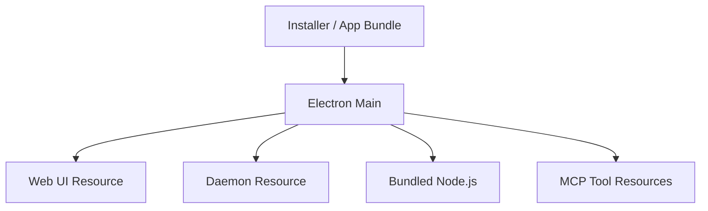

# Deployment View: Desktop

**Date**: 2026-06-09
**Source ADRs**: ADR-001, ADR-002, ADR-005, ADR-006
**Status**: Generated from accepted ADRs

## Purpose

Desktop deployment packages the Electron shell and all runtime resources needed
for local task execution. It is the distribution boundary for MyBoTeam.

## Runtime Environments

| Runtime | Packaged Location |
|---------|-------------------|
| Electron Main | `dist-electron/main` |
| Preload | `dist-electron/preload` |
| Web UI | `web-ui` extra resource |
| Daemon | `daemon` extra resource |
| MCP Tools | `mcp-tools` extra resource |
| Bundled Skills | `bundled-skills` extra resource |
| Bundled Node.js | Platform resource used for daemon/MCP execution |

## Deployment Topology

## Deployment Constraints

Packaging must validate runtime invariants before release. Required first-party
MCP assets, daemon dist files, bundled Node.js, and OpenCode binaries are not
optional for task startup.
