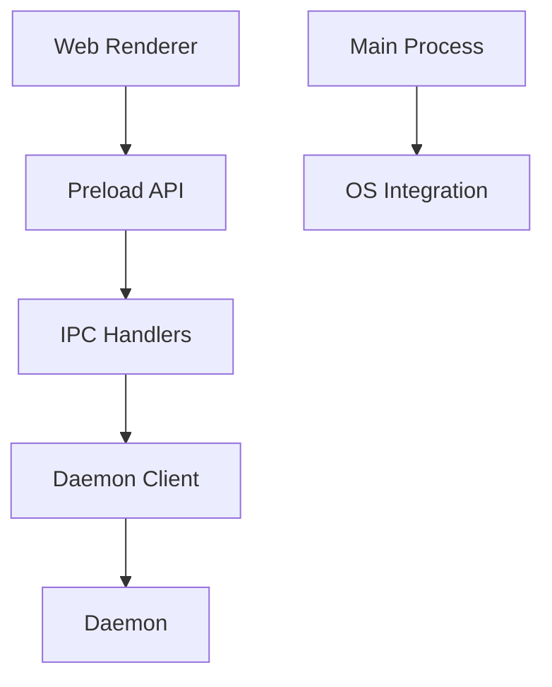

# Functional View: Desktop

**Date**: 2026-06-09
**Source ADRs**: ADR-001, ADR-002, ADR-005, ADR-006
**Status**: Generated from accepted ADRs

## Purpose

The Desktop sub-system is the privileged Electron shell. It bridges renderer UI
to daemon services and owns OS-level shell concerns without owning connector or
task domain logic.

## Functional Elements

| Element | Responsibility |
|---------|----------------|
| Main Process | Starts app lifecycle, windows, tray, menu, protocol handlers |
| Preload Handlers | Expose narrow typed `window.myboteam` capabilities |
| IPC Handlers | Validate renderer requests and delegate privileged work |
| Daemon Connector | Starts, reconnects, and talks to daemon through local transport |
| OAuth / OS Bridges | Provide browser, protocol, and callback flows for auth |
| Packager Scripts | Bundle web UI, daemon, Node.js, OpenCode, skills, and MCP assets |

## Interaction Diagram

## Functional Boundaries

Desktop connector code is limited to OS/browser/OAuth callback bridges. Domain
logic, token lifecycle, provider settings, secrets, and long-lived background
services belong to daemon services.
