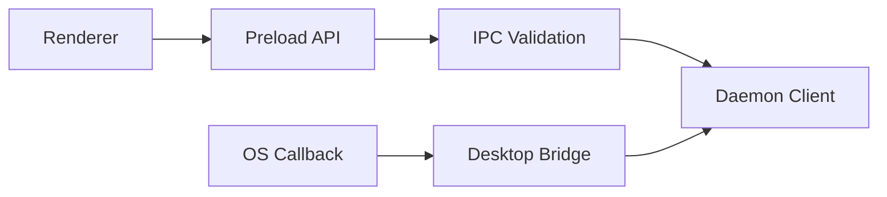

# Information View: Desktop

**Date**: 2026-06-09
**Source ADRs**: ADR-001, ADR-002, ADR-005, ADR-006
**Status**: Generated from accepted ADRs

## Purpose

Desktop information is mostly shell/runtime metadata and bridge payloads. The
daemon remains the owner of durable task, connector, provider, and secret data.

## Information Elements

| Element | Owner | Description |
|---------|-------|-------------|
| Shell Metadata | Desktop | Version, platform, Electron shell status |
| Window State | Desktop | Main window, tray, close behavior, startup state |
| IPC Payloads | Desktop boundary | Validated renderer requests and daemon responses |
| OAuth Callback Data | Desktop bridge | Short-lived callback code/state passed to daemon logic |
| Packaged Asset Manifest | Desktop packaging | Web UI, daemon dist, MCP tools, Node.js, OpenCode assets |
| Update Metadata | Desktop | Release feed and updater state |

## Data Flow

## Information Constraints

Desktop may bridge OAuth and OS callback payloads, but daemon owns token
lifecycle. Desktop must not persist provider secrets outside the approved daemon
secret-storage path.
