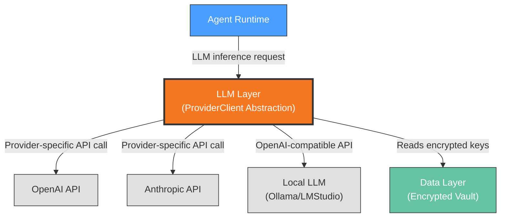

# Context View: LLM Layer

**Sub-System**: LLM Layer
**ADRs Referenced**: ADR-006
**Generated**: 2026-06-24

---

## 3.1 Context View

**Purpose**: Define system scope and external interactions for LLM connectivity

### 3.1.1 System Scope

The LLM Layer sub-system provides a unified provider abstraction for all LLM calls made by agents. It supports multiple providers (OpenAI, Anthropic, local LLMs via OpenAI-compatible API) with a hybrid configuration model: a global default provider for simplicity and per-agent overrides for power users. API keys are stored in the encrypted secrets vault and never leave the daemon process.

### 3.1.2 Stakeholders

| Stakeholder | Role | Key Concerns | Priority |
|-------------|------|--------------|----------|
| Agent Runtime (consumer) | Primary consumer of LLM inference | Latency, consistency, provider availability | High |
| End User (BYOK) | Key owner and bill payer | Cost control, privacy, provider choice | Critical |
| Power User | Wants per-agent model optimization | Model selection flexibility | Low |

### 3.1.3 External Entities

| Entity | Type | Interaction Type | Data Exchanged | Protocols |
|--------|------|------------------|----------------|-----------|
| OpenAI API | External API | REST/SSE | Chat completions, API key | HTTPS |
| Anthropic API | External API | REST/SSE | Chat completions, API key | HTTPS |
| Local LLM (Ollama/LMStudio) | Local process | HTTP REST | Chat completions | HTTP (localhost) |
| Data Layer (secrets vault) | Internal service | In-method call | Encrypted API keys | Method call |

### 3.1.4 Context Diagram

### 3.1.5 External Dependencies

| Dependency | Purpose | SLA Expectations | Fallback Strategy |
|------------|---------|------------------|-------------------|
| OpenAI API | Primary LLM provider | No SLA (API-dependent) | Retry with backoff; user-configured fallback provider |
| Anthropic API | Alternative LLM provider | No SLA (API-dependent) | Retry with backoff; fallback to global default |
| Local LLM (optional) | Privacy-preserving inference | No SLA (local process) | Graceful degradation if process not running |

---

## Perspective Considerations

### Security Considerations

API keys encrypted at rest in AES-256-GCM vault (ADR-004). Keys stored per provider, not per agent. Decrypted keys injected into Eve provider config at materialization time (in-memory only). Keys never enter the renderer process, never appear in logs. BYOK model means user controls all API costs and data exposure (ADR-006).

_Source ADRs: ADR-006, ADR-004_

### Performance Considerations

Provider abstraction adds minimal overhead (method call indirection). Local LLM latency depends on hardware. Provider API changes isolated to adapter layer. Per-agent override allows optimizing model choice per task type (e.g., Claude for reasoning, GPT-4 for structured data) (ADR-006).

_Source ADRs: ADR-006_

---

**Validation Checklist**:
- [x] System appears as exactly ONE node
- [x] No internal databases shown
- [x] No internal services shown beyond context
- [x] All entities are either stakeholders OR external systems
- [x] All connections cross the system boundary
- [x] **Mermaid Only**: All architectural diagrams use Mermaid syntax
