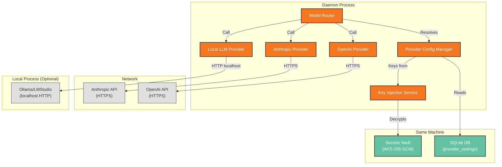

# Deployment View: LLM Layer

**Sub-System**: LLM Layer
**ADRs Referenced**: ADR-006
**Generated**: 2026-06-24
**Dependencies**: Context View, Functional View

---

## 3.6 Deployment View

**Purpose**: Physical environment — nodes, networks, storage for LLM connectivity

### 3.6.1 Runtime Environments

| Environment | Purpose | Infrastructure | Scale |
|-------------|---------|----------------|-------|
| User Desktop | LLM inference (production) | Daemon process (outbound HTTPS) | Single user |
| CI | Provider unit tests | Mock HTTP (no real API calls) | Ephemeral |

### 3.6.2 Network Topology

### 3.6.3 Hardware Requirements

| Component | CPU | Memory | Storage | Notes |
|-----------|-----|--------|---------|-------|
| ProviderClient Abstraction | Minimal | ~5MB (in-memory cache) | — | Per-agent config cached |
| Key Injection Service | Minimal | ~1MB | — | In-memory only during materialization |
| Local LLM (optional) | 4+ cores | 8-16GB | 4-12GB per model | External process via Ollama |

### 3.6.4 Third-Party Services

| Service | Purpose | Provider | Tier |
|---------|---------|----------|------|
| OpenAI API | Primary LLM provider | OpenAI | User BYOK (pay-per-token) |
| Anthropic API | Alternative LLM provider | Anthropic | User BYOK (pay-per-token) |
| Local LLM (optional) | Privacy-preserving inference | User-managed (Ollama) | Free (self-hosted) |

---

## Perspective Considerations

### Security Considerations

API keys encrypted in vault, injected in-memory only. Keys never persist in daemon process logs or renderer. HTTPS for all external LLM calls (TLS 1.3). Local LLM provider uses localhost HTTP — no data leaves machine. Provider SDKs audited for vulnerabilities (ADR-006).

_Source ADRs: ADR-006_

### Performance Considerations

Provider abstraction adds minimal overhead. Network latency to cloud providers is the dominant factor (200ms-5s). Local LLM latency depends on local hardware (GPU recommended). Connection pooling reused per provider. First call establishes connection, subsequent calls reuse (ADR-006).

_Source ADRs: ADR-006_

### Availability Considerations

Provider API failures detected at call time. Retry with same provider on transient errors. No automatic failover to alternative provider (requires user config). Local LLM requires user to manage the external process lifecycle (Ollama). Materialization caches provider config — survives daemon restart (ADR-006).

_Source ADRs: ADR-006_

---

**ADR Traceability:**

| ADR | Decision | Impact on Deployment View |
|-----|----------|----------------------------|
| ADR-006 | Hybrid global + per-agent LLM config | Defines provider deployment: in-process abstraction, outbound HTTPS |
