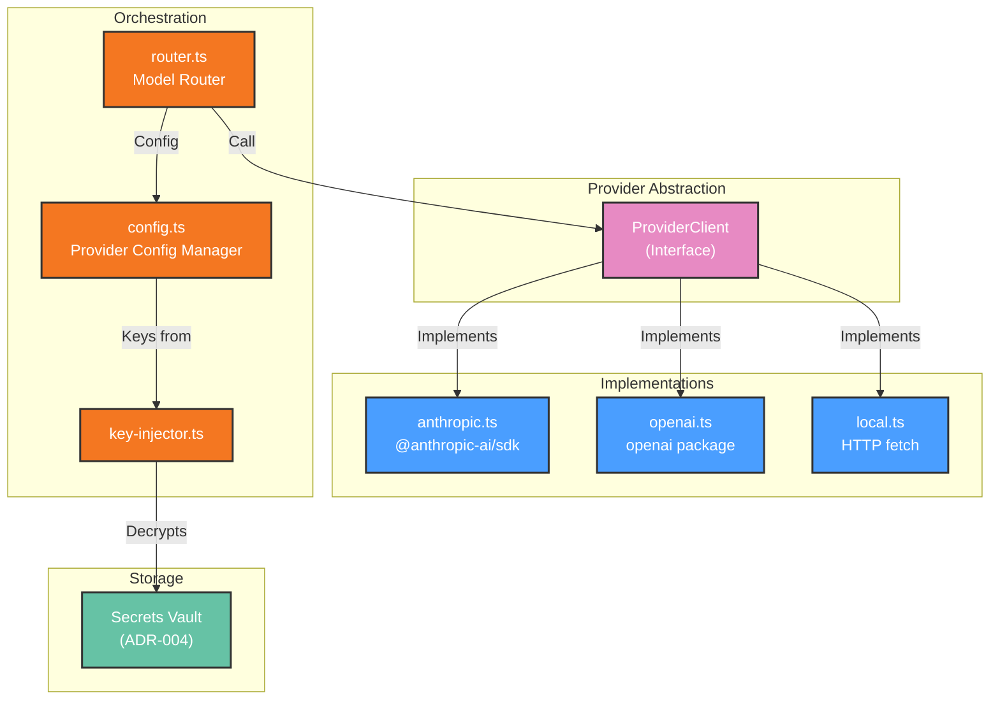

# Development View: LLM Layer

**Sub-System**: LLM Layer
**ADRs Referenced**: ADR-006
**Generated**: 2026-06-24
**Dependencies**: Functional View

---

## 3.5 Development View

**Purpose**: Constraints for developers — code organization, dependencies, testing for LLM connectivity

### 3.5.1 Code Organization

```text
packages/agent-core/src/providers/
├── client.ts               # ProviderClient interface definition
├── anthropic.ts            # Anthropic Provider implementation
├── openai.ts               # OpenAI Provider implementation
├── local.ts                # Local LLM Provider (OpenAI-compatible endpoint)
├── config.ts               # Provider Config Manager (global + per-agent)
├── key-injector.ts         # Key injection service (decrypts + injects at materialization)
├── router.ts               # Model Router (resolves provider + calls)
└── types.ts                # Provider-specific type definitions
```

### 3.5.2 Technology Stack Mapping

| Functional Role | Technology Choice | Version/Variant | ADR Reference |
|-----------------|-------------------|-----------------|---------------|
| LLM Provider Interface | TypeScript interface | — | ADR-006 |
| Anthropic Integration | @anthropic-ai/sdk | Latest | ADR-006 |
| OpenAI Integration | openai npm package | Latest | ADR-006 |
| Local LLM | OpenAI-compatible HTTP API | — | ADR-006 |
| Key Injector | Integrated with vault (ADR-004) | In-memory only | ADR-004, ADR-006 |

### 3.5.3 Technology Architecture



### 3.5.4 Module Dependencies

- Provider implementations depend on their respective SDK packages (`@anthropic-ai/sdk`, `openai`)
- All providers implement `ProviderClient` interface from `client.ts`
- `key-injector.ts` depends on vault module (ADR-004)
- `config.ts` depends on SQLite storage for provider_settings
- `router.ts` depends on all providers + config

### 3.5.5 Build & CI/CD

- **Build System**: Part of `@myboteam/agent-core`, built via tsup
- **CI Pipeline**: Provider interface compliance tests → each provider implementation unit tests (mocked HTTP) → integration tests with real provider API (gated, not run on every PR) → key injection integration tests
- **Mock LLM Provider**: Used in simulation tests — returns canned responses for deterministic agent testing

### 3.5.6 Development Standards

- Every new provider MUST implement the full `ProviderClient` interface
- Provider tests MUST mock HTTP layer (no real API calls in unit tests)
- Key injection tests MUST verify: keys decrypted in-memory only, never persisted to disk or logs
- Provider switching tests: switching global default or per-agent override must reflect in next materialization
- Local LLM provider tested against a mock HTTP server in CI

---

## Perspective Considerations

### Security Considerations

Provider SDK dependencies audited for vulnerabilities. Key injection tested for memory-only persistence. Local LLM provider sends no data to external networks. API keys validated at save time in UI (ADR-006).

_Source ADRs: ADR-006_

### Performance Considerations

Provider SDKs are the heaviest external dependencies. Each provider adds ~1-2MB to the daemon bundle. tsup tree-shaking removes unused providers. Local LLM provider has zero external SDK dependency (uses native fetch) (ADR-006).

_Source ADRs: ADR-006_

---

**ADR Traceability:**

| ADR | Decision | Impact on Development View |
|-----|----------|----------------------------|
| ADR-006 | Hybrid global + per-agent | Defines provider package structure, interface, implementations |
