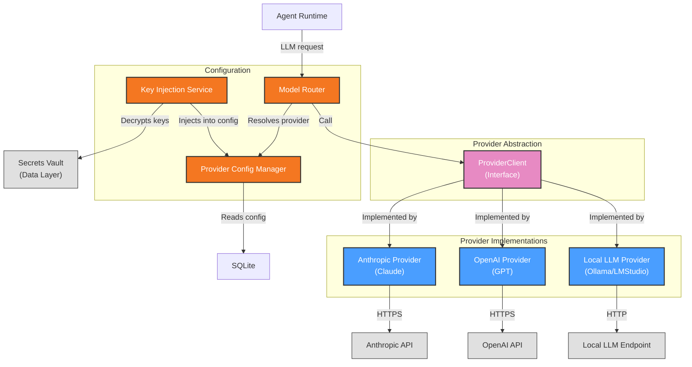

# Functional View: LLM Layer

**Sub-System**: LLM Layer
**ADRs Referenced**: ADR-006
**Generated**: 2026-06-24
**Dependencies**: Context View

---

## 3.2 Functional View

**Purpose**: Describe functional elements, responsibilities, and interactions for LLM connectivity

### 3.2.1 Functional Elements

| Element | Responsibility | Interfaces Provided | Dependencies |
|---------|----------------|---------------------|--------------|
| ProviderClient (Interface) | Abstract interface for all LLM providers | `complete(messages, config)` → `Response` | None (abstract) |
| Anthropic Provider | Claude model integration via Anthropic SDK | Implements ProviderClient | Anthropic API, API key (vault) |
| OpenAI Provider | GPT model integration via OpenAI SDK | Implements ProviderClient | OpenAI API, API key (vault) |
| Local LLM Provider | OpenAI-compatible local endpoint (Ollama/LMStudio) | Implements ProviderClient | Local HTTP endpoint |
| Provider Config Manager | Manages global default + per-agent overrides | `getConfig(agentId?)` → `ProviderConfig` | SQLite (provider_settings table) |
| Key Injection Service | Decrypts keys from vault, injects into provider config at materialization | `injectKeys(config)` → `RuntimeConfig` | Secrets Vault (ADR-004) |
| Model Router | Routes LLM call to correct provider based on config | `route(agentId, messages)` → `Response` | Provider Config Manager |

### 3.2.2 Element Interactions

### 3.2.3 Functional Boundaries

**What this system DOES:**

- Provide unified ProviderClient interface for all LLM providers
- Implement Anthropic (Claude) and OpenAI (GPT) as first-class providers
- Support local LLMs via OpenAI-compatible HTTP endpoint (Ollama, llama.cpp, LM Studio)
- Manage global default provider + optional per-agent provider/model overrides
- Inject decrypted API keys into provider config at Eve materialization time (in-memory only)
- Route LLM calls to correct provider based on resolved config

**What this system does NOT do:**

- Does NOT store API keys (delegates to Data Layer/secrets vault)
- Does NOT execute agent logic or tools
- Does NOT manage provider API key rotation or expiry
- Does NOT cache LLM responses (stateless by design)
- Does NOT expose decrypted keys outside daemon process

---

## Perspective Considerations

### Security Considerations

API keys encrypted at rest in vault (AES-256-GCM). Keys injected during materialization (in-memory only). Keys never enter renderer, logs, or traces. BYOK model: user controls cost and data exposure. Provider abstraction isolates from API-specific security concerns (ADR-006).

_Source ADRs: ADR-006, ADR-004_

### Performance Considerations

Provider abstraction adds minimal overhead. First-provider-call latency: provider-dependent (200ms-5s). Subsequent calls reuse same connection pool. Local LLM latency depends on hardware. Per-agent override enables optimizing model choice per task (ADR-006).

_Source ADRs: ADR-006_

### Evolution Considerations

Provider abstraction enables adding new providers without agent runtime changes. Extensible interface for future: Bedrock, Vertex, etc. Local LLM support covers absolute privacy requirement (REQ-002). Provider API changes isolated to adapter layer (ADR-006).

_Source ADRs: ADR-006_

---

## Validation Checklist

- [x] **Technology Neutrality**: All elements described by architectural role
- [x] **Diagram Consistency**: Mermaid diagram uses generic labels
- [x] **Interface Abstraction**: ProviderClient describes capabilities, not implementations
- [x] **Complete Coverage**: All provider management responsibilities represented
- [x] **Clear Boundaries**: Boundary rules clearly defined

---

**ADR Traceability:**

| ADR | Decision | Impact on Functional View |
|-----|----------|---------------------------|
| ADR-006 | Hybrid global + per-agent LLM config | Defines ProviderClient, all providers, Config Manager, Router |
