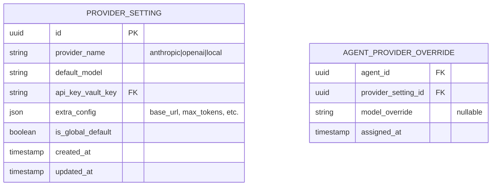

# Information View: LLM Layer

**Sub-System**: LLM Layer
**ADRs Referenced**: ADR-006
**Generated**: 2026-06-24
**Dependencies**: Functional View

---

## 3.3 Information View

**Purpose**: Describe data storage, management, and flow for LLM connectivity

### 3.3.1 Data Entities

| Entity | Storage Location | Owner Component | Lifecycle | Access Pattern |
|--------|------------------|-----------------|-----------|----------------|
| Provider Setting | SQLite (provider_settings) | Provider Config Manager | Create → Update → Delete | Read-heavy (materialization) |
| API Key (encrypted) | Vault (`secure-storage.json`) | Secrets Vault (ADR-004) | Create → Rotate → Delete | Read-once (materialization) |
| LLM Prompt/Response | In-memory (transient) | ProviderClient implementations | Ephemeral (per request) | Write-once, read-once (agent only) |
| Model Choice Cache | In-memory (config) | Provider Config Manager | Per-agent materialization | Read-on-materialize |

### 3.3.2 Data Model

### 3.3.3 Data Flow

**Key Data Flows:**

1. **Provider Config Flow**: Agent materializes → Provider Config Manager reads global default provider_setting → Checks agent for per-agent override → If override: merges with global → Key Injection Service decrypts vault key → Injects decrypted key into runtime config (in-memory only) → Runtime config passed to Eve materializer
2. **LLM Call Flow**: Eve runtime needs LLM completion → Calls Model Router with agent ID + messages → Router resolves provider (from materialized config) → Calls ProviderClient.complete() → Provider formats provider-specific request → Sends HTTPS request to provider API → Returns response → Runtime continues agent loop

### 3.3.4 Data Quality & Integrity

- **Consistency Model**: Strong (SQLite ACID)
- **Validation Rules**: Provider config validated on save (test connection); API key format validated before vault storage; provider switches mid-session handled via re-materialization
- **Retention Policy**: Provider settings retained indefinitely; API keys never persisted in plaintext; prompt/response data ephemeral (not stored)
- **Backup Strategy**: Provider settings backed up with SQLite database; API keys backed up with vault (encrypted)

---

## Perspective Considerations

### Security Considerations

API keys encrypted in vault with AES-256-GCM. Keys injected in-memory only at materialization. Keys never in renderer, logs, test fixtures, or traces. Provider abstraction isolates provider-specific security concerns. BYOK: user controls API costs and data exposure (ADR-006).

_Source ADRs: ADR-006_

### Performance Considerations

Provider abstraction adds minimal overhead (interface dispatch). First call ~provider-dependent latency (200ms-5s). Subsequent calls reuse connection pool. Local LLM latency depends on hardware. Per-agent override enables optimizing model per task type (ADR-006).

_Source ADRs: ADR-006_

---

**ADR Traceability:**

| ADR | Decision | Impact on Information View |
|-----|----------|----------------------------|
| ADR-006 | Hybrid global + per-agent LLM config | Defines provider settings, agent override, key injection flow |
