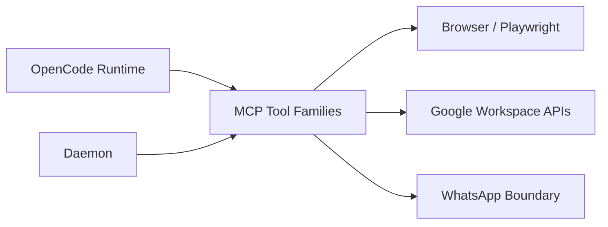

# Context View: MCP Tool Families

**Date**: 2026-06-09
**Source ADRs**: ADR-006
**Status**: Generated from accepted ADRs

## Purpose

MCP Tool Families are first-party tool packages bundled with MyBoTeam and exposed
to OpenCode runtimes through generated MCP configuration. They are grouped by
connector family for ownership and documentation.

## External Entities

| Entity | Type | Relationship |
|--------|------|--------------|
| OpenCode Runtime | Local consumer | Invokes MCP tool servers during task execution |
| Daemon | Local sub-system | Provides connector/token context and task lifecycle integration |
| Browser / Playwright Runtime | Local dependency | Supports browser automation tool families |
| Google Workspace APIs | External APIs | Used by Gmail, Calendar, GWS, and file-picker tools |
| WhatsApp Integration | External service boundary | Used by the WhatsApp tool family |

## Context Diagram

## Constraints

Required first-party MCP assets are fail-fast packaging and startup invariants.
Missing dist files or bundled Node.js paths must not silently disable required
tools. Each family should keep connector-specific logic out of unrelated tools.
