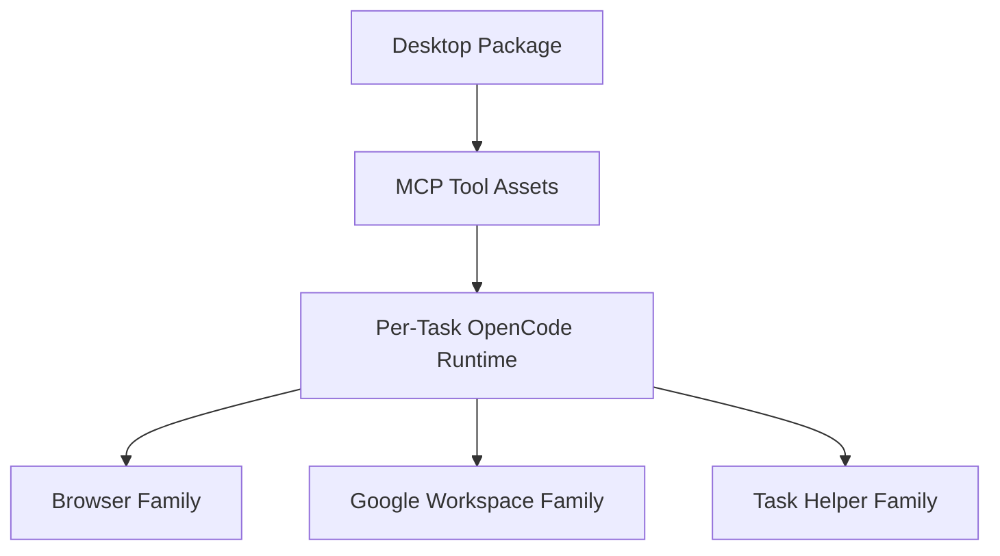

# Deployment View: MCP Tool Families

**Date**: 2026-06-09
**Source ADRs**: ADR-006
**Status**: Generated from accepted ADRs

## Purpose

MCP Tool Families deploy as first-party tool assets bundled into the desktop
package and invoked by per-task OpenCode runtimes through generated config.

## Runtime Environments

| Tool Family | Deployment Form |
|-------------|-----------------|
| Browser Tools | Packaged MCP/tool assets with Playwright-backed runtime needs |
| Google Workspace Tools | Packaged Gmail, Calendar, GWS, and file-picker tool assets |
| WhatsApp Tools | Packaged WhatsApp connector tool assets |
| Task Helper Tools | Packaged task start, complete, and auth helper assets |
| Remote MCP Entries | Generated OpenCode config for user-configured remote MCP servers |

## Deployment Topology

## Deployment Constraints

Required first-party MCP dist entrypoints and bundled Node.js paths are fail-fast
invariants. Tool families must keep connector-specific dependencies isolated so
one family does not accidentally force unrelated tool behavior.
