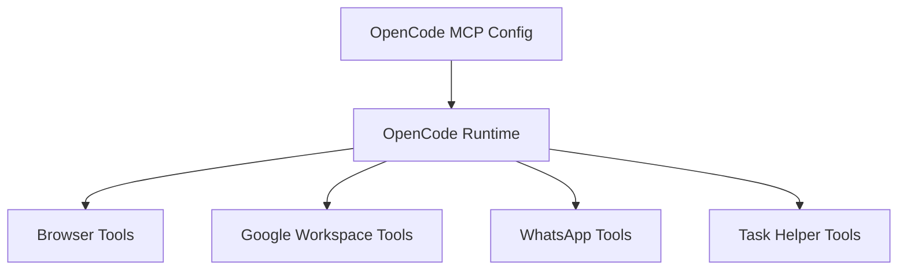

# Functional View: MCP Tool Families

**Date**: 2026-06-09
**Source ADRs**: ADR-006
**Status**: Generated from accepted ADRs

## Purpose

MCP Tool Families provide packaged first-party capabilities to OpenCode. They are
split by connector family so ownership and failure boundaries are explicit while
remaining bundled with the desktop product.

## Functional Elements

| Element | Responsibility |
|---------|----------------|
| Browser Tool Family | Provides Playwright/dev-browser automation capabilities |
| Google Workspace Family | Provides Gmail, Calendar, GWS, and file-picker capabilities |
| WhatsApp Family | Provides WhatsApp-specific task integration |
| Task Helper Family | Provides start-task, complete-task, and connector-auth helpers |
| MCP Packaging | Builds tool dist outputs for dev and packaged modes |
| OpenCode MCP Config | Injects tool entrypoints into per-task OpenCode runtimes |

## Interaction Diagram

## Functional Boundaries

Required first-party tool assets are fail-fast invariants. Missing dist files or
bundled Node.js paths must fail packaged build validation and task startup rather
than silently disabling required tools.
