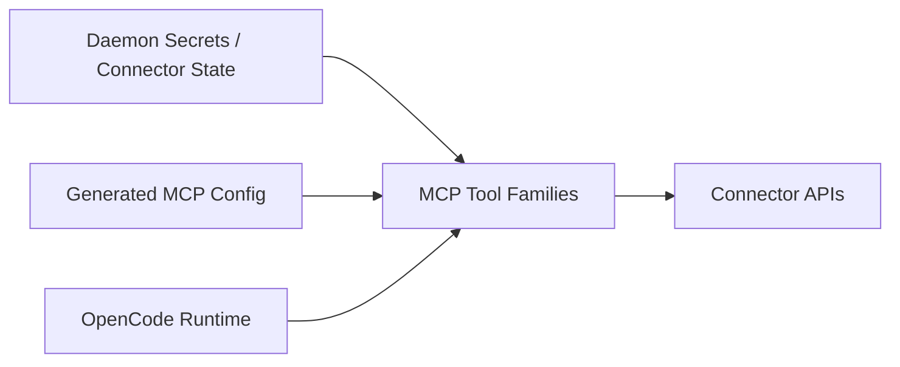

# Information View: MCP Tool Families

**Date**: 2026-06-09
**Source ADRs**: ADR-006
**Status**: Generated from accepted ADRs

## Purpose

MCP Tool Families consume runtime configuration and connector credentials to
perform tool actions. They do not own long-term token lifecycle; daemon services
do.

## Information Elements

| Element | Source | Description |
|---------|--------|-------------|
| Tool Entry Configuration | Agent Core | Command, environment, timeout, and MCP server metadata |
| Browser Session Data | Browser tools | Local automation state and browser runtime handles |
| Google Workspace Tokens | Daemon secrets | Tokens used by Gmail, Calendar, GWS, and file-picker tools |
| WhatsApp Session Data | WhatsApp family | Connector-specific runtime/session state |
| Task Helper Payloads | OpenCode / Daemon | Task start, completion, and connector-auth requests |
| Tool Diagnostics | MCP tools | Logs, structured events, and user-visible failures |

## Data Flow

## Information Constraints

MCP tool families may use connector tokens supplied through approved daemon
paths, but they must not persist long-term secrets outside the encrypted storage
policy or leak tokens through diagnostics.
