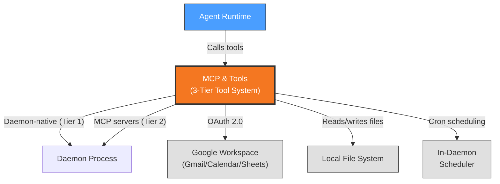

# Context View: MCP & Tools

**Sub-System**: MCP & Tools
**ADRs Referenced**: ADR-003, ADR-010
**Generated**: 2026-06-24

---

## 3.1 Context View

**Purpose**: Define system scope and external interactions for tools and MCP servers

### 3.1.1 System Scope

The MCP & Tools sub-system provides all executable capabilities that agents use to interact with the outside world. It organizes tools into three tiers: daemon-native (file operations, sub-500ms), bundled MCP servers (process-isolated, for email/calendar/workspace), and Eve tool stubs (utility functions). ADR-010 extends this with productivity tools: natural language scheduling, inline document editing with version history, and notes/todos with reminders.

### 3.1.2 Stakeholders

| Stakeholder | Role | Key Concerns | Priority |
|-------------|------|--------------|----------|
| Agent Runtime (consumer) | Internal consumer calling tools | Latency, reliability, consistent interface | High |
| End User | Indirect consumer via agent | Correct tool execution, no data corruption | High |
| Connector Developer | Builds/maintains MCP servers | Process isolation, debugging, OAuth handling | Medium |

### 3.1.3 External Entities

| Entity | Type | Interaction Type | Data Exchanged | Protocols |
|--------|------|------------------|----------------|-----------|
| Daemon Process | Internal | In-method calls (daemon-native), stdio (MCP) | Tool call requests/results | Method calls, MCP stdio |
| Google Workspace | External API | OAuth 2.0, REST, SSE | Emails, calendar events, documents | HTTPS |
| Local File System | Local OS | POSIX/Windows API | File contents, directory listings | Native FS |
| Scheduler (in-daemon) | Internal service | In-method cron engine | Schedule state, run history | node-cron |

### 3.1.4 Context Diagram

### 3.1.5 External Dependencies

| Dependency | Purpose | SLA Expectations | Fallback Strategy |
|------------|---------|------------------|-------------------|
| Google Workspace API | Email send/read, calendar CRUD, Sheets/Docs | Google SLA (99.9%) | Offline queue with auto-retry; user notified of failures |
| Local File System | All file operations | OS-native | Workspace confinement prevents data loss |
| node-cron (internal) | Schedule execution | Process memory | Schedules persisted in SQLite; survive daemon restart |

---

## Perspective Considerations

### Security Considerations

Three-tier isolation: daemon-native tools run in-process (fast but trusted), MCP servers run as separate child processes (process-level isolation), Eve stubs are lightweight functions in agent process. File confinement to workspace root. OAuth tokens refreshed automatically. `complete-task` and `request-connector-auth` available as both daemon-native stubs (fast path) and MCP server variants (plugin consumers) (ADR-003).

_Source ADRs: ADR-003, ADR-010_

### Performance Considerations

Daemon-native tools: sub-500ms. MCP server spawn: +200-500ms first use. Eve stubs: negligible overhead. Scheduling supports 50+ concurrent schedules without degradation. Document versioning increases storage proportionally to edit count (ADR-010).

_Source ADRs: ADR-003, ADR-010_

---

**Validation Checklist**:
- [x] System appears as exactly ONE node
- [x] No internal databases shown
- [x] No internal services shown beyond context
- [x] All entities are either stakeholders OR external systems
- [x] All connections cross the system boundary
- [x] **Mermaid Only**: All architectural diagrams use Mermaid syntax
