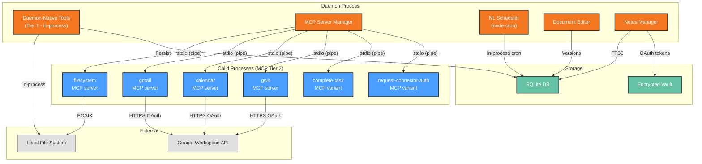

# Deployment View: MCP & Tools

**Sub-System**: MCP & Tools
**ADRs Referenced**: ADR-003, ADR-010
**Generated**: 2026-06-24
**Dependencies**: Context View, Functional View

---

## 3.6 Deployment View

**Purpose**: Physical environment — nodes, networks, storage for tools and MCP servers

### 3.6.1 Runtime Environments

| Environment | Purpose | Infrastructure | Scale |
|-------------|---------|----------------|-------|
| User Desktop | Tool execution (production) | Daemon process + MCP child processes | Single user |
| CI | MCP server integration tests | GitHub Actions | Ephemeral |

### 3.6.2 Network Topology

### 6.3 Hardware Requirements

| Component | CPU | Memory | Storage | Notes |
|-----------|-----|--------|---------|-------|
| Daemon-Native Tools | Minimal | ~10MB (in-process) | — | No additional overhead |
| Per MCP Server | ~0.1 core (idle) | ~15MB per server | ~5MB per server package | Lazy-spawned on first use |
| Scheduler (node-cron) | Minimal | ~5MB (in-process) | ~1MB (schedule data) | 50+ concurrent schedules |
| Document Version History | — | — | Variable (per edit) | Grows with usage |
| Notes Storage | — | — | Variable | Proportional to note count |

### 3.6.4 Third-Party Services

| Service | Purpose | Provider | Tier |
|---------|---------|----------|------|
| Google Workspace API | Gmail, Calendar, Sheets/Docs | Google | Free to Workspace (user choice) |
| NLParsing (scheduling) | Built-in (no external service) | — | — |

---

## Perspective Considerations

### Security Considerations

MCP server process isolation: each server in own process with restricted filesystem access. Sensitive paths blocked globally. OAuth tokens stored in encrypted vault, refreshed automatically. `edit` fails atomically on mismatch (ADR-003, ADR-010). Scheduler runs in-process — no external network exposure.

_Source ADRs: ADR-003, ADR-010_

### Performance Considerations

Daemon-native tools: sub-500ms. MCP server first-call: +200-500ms spawn. Subsequent calls: sub-100ms (process is already running). Scheduler uses in-process cron — no external dependencies. FTS5 search: sub-100ms. Document versioning: storage proportional to edit count (ADR-003, ADR-010).

_Source ADRs: ADR-003, ADR-010_

---

**ADR Traceability:**

| ADR | Decision | Impact on Deployment View |
|-----|----------|----------------------------|
| ADR-003 | 3-Tier tool organization | Defines MCP process deployment, daemon-native in-process tools |
| ADR-010 | Productivity tools | Defines scheduler, document editor, notes manager deployment |
