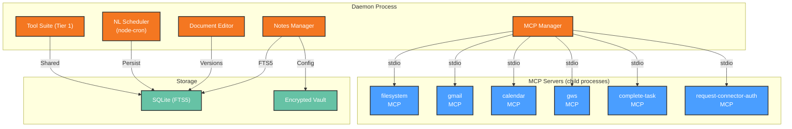

# Development View: MCP & Tools

**Sub-System**: MCP & Tools
**ADRs Referenced**: ADR-003, ADR-010
**Generated**: 2026-06-24
**Dependencies**: Functional View

---

## 3.5 Development View

**Purpose**: Constraints for developers — code organization, dependencies, testing for tools and MCP servers

### 3.5.1 Code Organization

```text
apps/daemon/src/services/
├── tool-suite.ts          # Daemon-native tool suite (Tier 1)
├── scheduler.service.ts   # NL Scheduling (ADR-010)
├── document-editor.ts     # FIND/REPLACE editing + version history (ADR-010)
├── notes-manager.ts       # Notes & Todos CRUD (ADR-010)
└── mcp-manager.ts         # MCP server spawn/kill lifecycle (Tier 2)

packages/mcp-servers/
├── filesystem/
│   ├── src/index.ts       # MCP server definition
│   └── package.json       # @myboteam/mcp-filesystem
├── gmail-mcp/
│   ├── src/index.ts
│   └── package.json
├── calendar-mcp/
│   ├── src/index.ts
│   └── package.json
├── gws-mcp/               # Google Workspace (Sheets, Docs)
│   ├── src/index.ts
│   └── package.json
├── complete-task/         # External MCP variant for plugin consumers
│   ├── src/index.ts
│   └── package.json
└── request-connector-auth/# External MCP variant for plugin consumers
    ├── src/index.ts
    └── package.json

bundled-skills/            # Shipped skills (read-only, ADR-003 format)
└── *.md
```

### 3.5.2 Technology Stack Mapping

| Functional Role | Technology Choice | Version/Variant | ADR Reference |
|-----------------|-------------------|-----------------|---------------|
| Daemon-Native Tools | In-process TypeScript services | — | ADR-003 |
| MCP Server Framework | @modelcontextprotocol/sdk | StdioServerTransport | ADR-003 |
| MCP Server Build | tsup → output dist/index.mjs | — | ADR-003 |
| Scheduling Engine | node-cron (in-process) | — | ADR-010 |
| Document Storage | SQLite + File System | FTS5 for search | ADR-004, ADR-010 |
| Notes Full-Text Search | SQLite FTS5 | — | ADR-010 |
| Skill Format | Markdown + YAML frontmatter | SKILL.md | ADR-003 |

### 3.5.3 Technology Architecture



### 3.5.4 Module Dependencies

- Each MCP server is an independent npm package in `packages/mcp-servers/`
- Daemon-native tools have zero external dependencies (in-process)
- Scheduling depends on node-cron (bundled in daemon)
- Document editor and notes manager depend on SQLite (via agent-core storage)
- MCP servers built independently with tsup, registered at agent materialization time

### 3.5.5 Build & CI/CD

- **Build System**: Each MCP server built independently via tsup; daemon native tools part of daemon build
- **CI Pipeline**: MCP server unit tests → MCP contract tests (validate tool definitions against MCP protocol) → daemon native tool integration tests → scheduler simulation tests
- **OAuth Testing**: Google Workspace tools tested with mock OAuth tokens in CI (no real API calls)

### 3.5.6 Development Standards

- Each MCP server MUST have: unit tests + MCP protocol compliance tests (validate tool definitions, call format, response format)
- Daemon-native tools: 85%+ line coverage
- Document edit: exhaustive uniqueness check tests (found, not found, not unique)
- Schedule NL parsing: tested against edge cases (relative time, multiple recurrences)

---

## Perspective Considerations

### Security Considerations

MCP servers built as independent packages with process isolation. OAuth tokens handled via vault. Sensitive paths blocked by FS access rules. Document edit fails atomically on mismatch — prevents data loss. Skill format validated by pipeline (ADR-003, ADR-010).

_Source ADRs: ADR-003, ADR-010_

### Performance Considerations

Daemon-native tools sub-500ms. MCP server spawn 200-500ms. tsup builds keep MCP entry points lean. node-cron runs in-process — no external process overhead for scheduling. FTS5 search sub-100ms (ADR-003, ADR-010).

_Source ADRs: ADR-003, ADR-010_

---

**ADR Traceability:**

| ADR | Decision | Impact on Development View |
|-----|----------|----------------------------|
| ADR-003 | 3-Tier tool + MCP + skills | Defines MCP server structure, daemon-native tools, skill pipeline |
| ADR-010 | Productivity tools | Defines scheduler, document editor, notes manager code locations |
