# Functional View: MCP & Tools

**Sub-System**: MCP & Tools
**ADRs Referenced**: ADR-003, ADR-010
**Generated**: 2026-06-24
**Dependencies**: Context View

---

## 3.2 Functional View

**Purpose**: Describe functional elements, responsibilities, and interactions for tools and MCP servers

### 3.2.1 Functional Elements

| Element | Responsibility | Interfaces Provided | Dependencies |
|---------|----------------|---------------------|--------------|
| Daemon-Native Tool Suite | File operations in daemon process (sub-500ms) | `read`, `write`, `edit`, `ls`, `glob`, `grep`, `complete-task`, `request-connector-auth` | Daemon process (in-method) |
| MCP Server Manager | Spawn/kill MCP servers, maintain lifecycle | Server registry, status reporting | Daemon (child_process) |
| Filesystem MCP Server | Read, write, list, copy, move, delete files (permission-scoped) | MCP tool definitions | Local File System |
| Gmail MCP Server | Email read/send with Google OAuth | MCP tool definitions | Google Workspace API |
| Calendar MCP Server | Google Calendar management | MCP tool definitions | Google Workspace API |
| GWS MCP Server | Google Sheets, Docs integration | MCP tool definitions | Google Workspace API |
| Eve Tool Stubs | Lightweight utility functions in agent process | `get_local_time`, calculations | None |
| Skill Discovery Pipeline | Scan directories, parse frontmatter, inject into prompt | `<available_skills>` XML block | File System, SQLite |
| NL Scheduler | Natural language cron scheduling (at/every/cron) | Agent tools: `create_schedule`, `list_schedules`, etc. | node-cron (in-process) |
| Document Editor | FIND/REPLACE surgical editing with version history | `read_file`, `edit_file`, `suggest_edit`, `list_versions`, `rollback` | SQLite, File System |
| Notes & Todos Manager | Full CRUD notes with checklists, labels, reminders | `create_note`, `list_notes`, `update_note`, `delete_note`, `toggle_todo`, `search_notes` | SQLite (FTS5) |

### 3.2.2 Element Interactions

```mermaid
graph TD
    subgraph "Tier 1: Daemon-Native"
        FileTools["File Tool Suite<br/>(read/write/edit/ls/glob/grep)"]
        SignalTools["complete-task<br/>request-connector-auth"]
    end

    subgraph "Tier 2: MCP Servers"
        MCPMgr["MCP Server Manager"]
        FSMCP["Filesystem MCP"]
        Gmail["Gmail MCP"]
        Calendar["Calendar MCP"]
        GWS["GWS MCP"]
    end

    subgraph "Tier 3: Eve Stubs"
        Stubs["Eve Tool Stubs<br/>(utility fns)"]
    end

    subgraph "Productivity (ADR-010)"
        Scheduler["NL Scheduler"]
        DocEditor["Document Editor"]
        Notes["Notes & Todos Manager"]
    end

    subgraph "System"
        SkillPipeline["Skill Discovery Pipeline"]
    end

    %% Agent calls tools
    Agent["Agent Runtime"] -->|"Tier 1 calls (in-process)"| FileTools
    Agent -->|"Tier 2 calls (stdio)"| MCPMgr
    MCPMgr -->|"Spawns"| FSMCP
    MCPMgr -->|"Spawns"| Gmail
    MCPMgr -->|"Spawns"| Calendar
    MCPMgr -->|"Spawns"| GWS
    Agent -->|"Tier 3 calls"| Stubs
    Agent -->|"Productivity calls"| Scheduler
    Agent -->|"Doc editing"| DocEditor
    Agent -->|"Notes CRUD"| Notes

    Agent -->|"Skills"| SkillPipeline

    classDef tier1 fill:#f47721,stroke:#333,stroke-width:2px,color:#fff
    classDef tier2 fill:#4a9eff,stroke:#333,stroke-width:2px,color:#fff
    classDef tier3 fill:#66c2a5,stroke:#333,stroke-width:2px,color:#fff
    classDef productivity fill:#8da0cb,stroke:#333,stroke-width:2px,color:#fff
    classDef agentNode fill:#e78ac3,stroke:#333,stroke-width:2px,color:#fff

    class FileTools,SignalTools tier1
    class MCPMgr,FSMCP,Gmail,Calendar,GWS tier2
    class Stubs tier3
    class Scheduler,DocEditor,Notes productivity
    class Agent,SkillPipeline agentNode
```

### 3.2.3 Functional Boundaries

**What this system DOES:**

- Execute file operations in-process (daemon-native) with sub-500ms latency
- Run MCP servers as isolated child processes (process-level sandboxing)
- Provide lightweight utility functions as Eve stubs (no process overhead)
- Parse `complete-task` and `request-connector-auth` as both daemon-native stub + external MCP variant
- Discover skills from `bundled-skills/` and `{dataDir}/skills/`, parse frontmatter, inject into agent prompt
- Schedule tasks via NL (at/every/cron) with CRUD management and run history
- Edit documents via FIND/REPLACE with version history and rollback
- Manage notes/todos with checklists, labels, reminders, and FTS5 search

**What this system does NOT do:**

- Does NOT execute agent logic or routing (owned by Agent Runtime)
- Does NOT make LLM provider calls (owned by LLM Layer)
- Does NOT manage agent lifecycle (owned by Agent Runtime)
- Does NOT enforce HITL permissions (owned by System/HITL Manager)

---

## Perspective Considerations

### Security Considerations

File confinement to workspace root (configurable). MCP process isolation: each server in own process with restricted FS. Deny-precedence file access rules. Sensitive paths always blocked. OAuth tokens refreshed automatically. `edit` fails atomically on non-unique match — prevents data corruption (ADR-003, ADR-010).

_Source ADRs: ADR-003, ADR-010_

### Performance Considerations

Tier 1 (daemon-native): sub-500ms. Tier 2 (MCP): +200-500ms first spawn. Tier 3 (stubs): negligible. Scheduler: 50+ concurrent schedules. Document versioning: proportional storage to edit count. FTS5 search: sub-100ms (ADR-003, ADR-010).

_Source ADRs: ADR-003, ADR-010_

### Evolution Considerations

New MCP servers added as independent packages in `packages/mcp-servers/` — no core changes. Skill format owned by ADR-003, lifecycle by ADR-009. Productivity tools (scheduling, docs, notes) built as daemon services with full CRUD UI (ADR-010).

_Source ADRs: ADR-003, ADR-010_

---

## Validation Checklist

- [x] **Technology Neutrality**: All elements described by architectural role
- [x] **Diagram Consistency**: Mermaid diagram uses generic labels
- [x] **Interface Abstraction**: Interfaces describe capabilities
- [x] **Complete Coverage**: All 3 tiers + productivity tools represented
- [x] **Clear Boundaries**: Boundary rules clearly defined

---

**ADR Traceability:**

| ADR | Decision | Impact on Functional View |
|-----|----------|---------------------------|
| ADR-003 | 3-Tier tool organization + Skill pipeline | Defines all tool tiers, MCP Manager, Skill Discovery |
| ADR-010 | Productivity tools (scheduling, docs, notes) | Adds Scheduler, DocEditor, Notes Manager |
