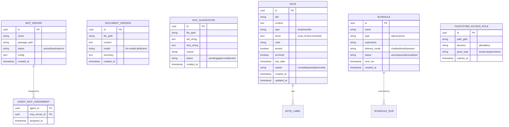

# Information View: MCP & Tools

**Sub-System**: MCP & Tools
**ADRs Referenced**: ADR-003, ADR-010
**Generated**: 2026-06-24
**Dependencies**: Functional View

---

## 3.3 Information View

**Purpose**: Describe data storage, management, and flow for tools and MCP servers

### 3.3.1 Data Entities

| Entity | Storage Location | Owner Component | Lifecycle | Access Pattern |
|--------|------------------|-----------------|-----------|----------------|
| MCP Server Definition | SQLite (mcp_servers) | MCP Server Manager | Create → Update → Archive | Read-heavy (materialization) |
| Agent-MCP Assignment | SQLite (agent_mcp_assignments) | MCP Server Manager | Create → Delete | Read-heavy (per agent) |
| Tool Call (from agent) | SQLite (tool_calls) | All tools | Append-only | Write-heavy |
| File Access Rule | SQLite (filesystem_access_rules) | MCP Process Manager | Create → Update → Expire | Read-heavy (per file op) |
| Document Version | SQLite (document_versions) | Document Editor | Append-only per edit | Write-once, read-history |
| Document Suggestion | SQLite (doc_suggestions) | Document Editor | Create → Approve/Deny → Apply | Write-once, read-pending |
| Note | SQLite (notes) | Notes Manager | Create → Update → Archive | Read-write |
| Note Label | SQLite (note_labels, note_label_assignments) | Notes Manager | Create → Delete | Read-heavy (filters) |
| Schedule | SQLite (schedules) | NL Scheduler | Create → Update → Pause → Delete | Read-write |
| Schedule Run History | SQLite (schedule_run_history) | NL Scheduler | Append-only (last 50) | Write-heavy |
| Bundled Skill (SKILL.md) | File System (`bundled-skills/`) | Skill Discovery Pipeline | Read-only (shipped) | Read-heavy (session start) |
| User Skill (SKILL.md) | File System (`{dataDir}/skills/`) | Skill Workshop | Create → Update → Delete | Read-heavy (session start) |

### 3.3.2 Data Model

### 3.3.3 Data Flow

**Key Data Flows:**

1. **Tool Execution Flow**: Agent calls tool (via MCP) → Daemon resolves tool to tier (1/2/3) → Tier 1: in-process execution; Tier 2: spawn MCP server if not running, send tool call via stdio; Tier 3: execute Eve stub directly → Result returned to agent → Tool call logged
2. **Document Editing Flow**: Agent calls `edit_file` → Uniqueness check on oldString → If pass: apply edit, create document_version with diff + model attribution + summary; If fail: return error atomically → Suggestion mode: store doc_suggestion (pending) → User approves/denies → Applied or discarded
3. **Schedule Execution Flow**: Current time matches schedule expression → Daemon scheduler fires → Triggers delivery (chat announcement, webhook POST, or session save) → Run recorded in schedule_run_history → Next run calculated

### 3.3.4 Data Quality & Integrity

- **Consistency Model**: Strong (SQLite ACID)
- **Validation Rules**: `edit` fails atomically if oldString not found or not unique; file path validation against workspace root; MCP server manifests validated before spawn
- **Retention Policy**: Document versions retained indefinitely; schedule run history last 50 entries; note archive instead of delete; tool calls appended indefinitely for audit
- **Backup Strategy**: Covered by Data Layer backup (SQLite + file system)

---

## Perspective Considerations

### Security Considerations

File access rules: deny-precedence, most specific path wins. Sensitive paths always blocked. Document edit fails atomically on non-unique match (data corruption prevention). MCP server process isolation prevents cross-server data access. OAuth tokens refreshed automatically (ADR-003, ADR-010).

_Source ADRs: ADR-003, ADR-010_

### Performance Considerations

Daemon-native tools: sub-500ms. MCP server spawn: 200-500ms first use. Document versioning: storage increases per edit. FTS5 search (notes): sub-100ms. Scheduling: 50+ concurrent schedules with in-process cron (ADR-003, ADR-010).

_Source ADRs: ADR-003, ADR-010_

---

**ADR Traceability:**

| ADR | Decision | Impact on Information View |
|-----|----------|----------------------------|
| ADR-003 | 3-Tier tool organization | Defines MCP server, assignment, file access rule entities |
| ADR-010 | Productivity tools | Defines document version, suggestion, note, schedule entities |
