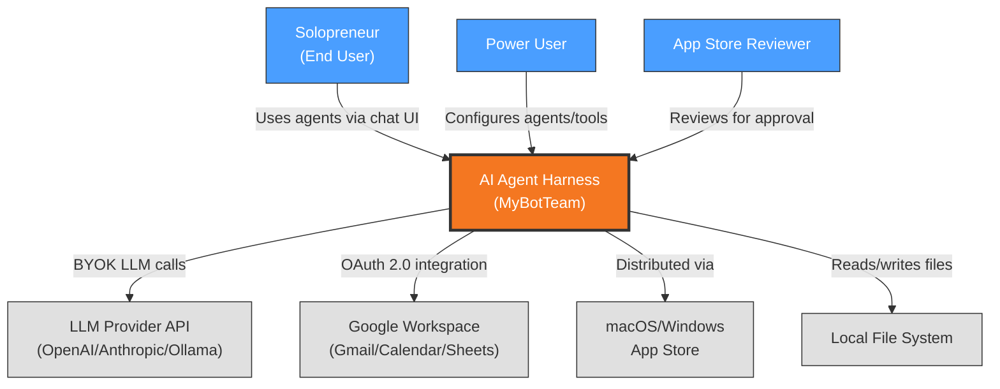

# Context View: System

**Sub-System**: System (Cross-cutting)
**ADRs Referenced**: ADR-001, ADR-007, ADR-008, ADR-011
**Generated**: 2026-06-24

---

## 3.1 Context View

**Purpose**: Define system scope and external interactions for the top-level system architecture

### 3.1.1 System Scope

The System sub-system encompasses the cross-cutting architectural decisions that define how the entire AI Agent Harness is structured: layered desktop architecture with Unix socket JSON-RPC (ADR-001), monorepo package organization (ADR-007), human-in-the-loop security (ADR-008), and multi-layer testing strategy (ADR-011). This sub-system owns the communication, packaging, and governance layers that all other sub-systems build upon.

### 3.1.2 Stakeholders

| Stakeholder | Role | Key Concerns | Priority |
|-------------|------|--------------|----------|
| Solopreneur (End User) | Non-technical small business owner using agents for admin tasks | Usability, reliability, privacy, local-first operation | High |
| Power User | Technical user configuring custom agents/MCP servers | Extensibility, observability, debugging | Medium |
| App Store Reviewer | macOS/Windows store approval process | Security, user-initiated actions only, sandboxing | Critical |

### 3.1.3 External Entities

| Entity | Type | Interaction Type | Data Exchanged | Protocols |
|--------|------|------------------|----------------|-----------|
| LLM Provider API (OpenAI, Anthropic, Ollama) | External API | HTTPS REST | Prompts, responses, API keys | HTTPS, SSE |
| Google Workspace (Gmail, Calendar, Sheets) | External API | OAuth 2.0, REST | Emails, events, documents | HTTPS, OAuth 2.0 |
| macOS/Windows App Store | Distribution | Store APIs | App bundles, updates | Store protocols |
| File System (User Machine) | Local OS | POSIX/Windows APIs | Files, directories | Native FS |

### 3.1.4 Context Diagram

### 3.1.5 External Dependencies

| Dependency | Purpose | SLA Expectations | Fallback Strategy |
|------------|---------|------------------|-------------------|
| LLM Provider API | All agent intelligence (reasoning, generation) | Provider-dependent (no SLA guaranteed) | Degraded mode: return cached results; user notified |
| Google Workspace API | Email, calendar, document integration | Google SLA (99.9%) | Offline queue with retry on reconnection |
| Local File System | Agent file operations | OS-native (no SLA) | Sandboxed workspace prevents data loss |

---

## Perspective Considerations

### Security Considerations

System boundary enforces strict 4-link chain: React UI → contextBridge IPC → Electron Main → Unix socket → Daemon. Renderer has zero filesystem or socket access (ADR-001). HITL triggers before sensitive operations (email, external calendar, filesystem outside workspace). MCP server process isolation prevents cross-server privilege escalation (ADR-008).

_Source ADRs: ADR-001, ADR-008_

### Performance Considerations

JSON-RPC over Unix sockets provides sub-millisecond IPC latency. Daemon-native tools (Tier 1) bypass IPC entirely for file operations (sub-500ms). MCP server startup adds 200-500ms on first use per tool. Exponential backoff reconnection (200ms → 5000ms) for daemon connectivity (ADR-001).

_Source ADRs: ADR-001, ADR-007_

### Location Considerations

Local-first architecture: all data stays on user machine. No cloud dependency. Data directory at `~/.myboteam/` or `MYBOTEAM_DATA_DIR` env var. Daemon as login item for persistent background execution (ADR-008).

_Source ADRs: ADR-001, ADR-008_

### Regulation Considerations

Local-first model minimizes regulatory surface. No user data transmitted to cloud (except BYOK LLM calls which user controls). App store compliance requires user-initiated actions (ADR-008). Privacy-respecting opt-in telemetry for engagement metrics (PDR-005).

_Source ADRs: ADR-008_

---

**Validation Checklist**:
- [x] System appears as exactly ONE node
- [x] No internal databases shown
- [x] No internal services shown
- [x] All entities are either stakeholders OR external systems
- [x] All connections cross the system boundary
- [x] **Mermaid Only**: All architectural diagrams use Mermaid syntax
