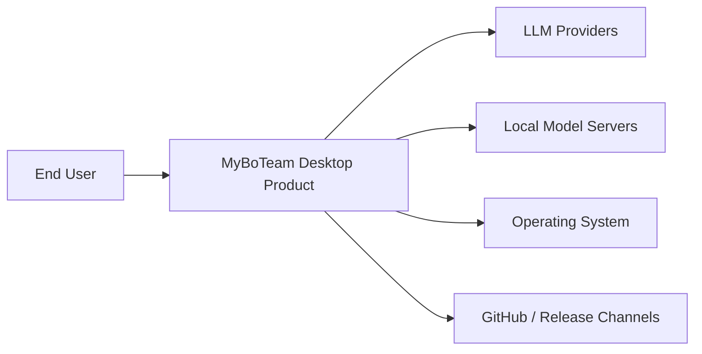

# Context View: System

**Date**: 2026-06-09
**Source ADRs**: ADR-001
**Status**: Generated from accepted ADRs

## Purpose

The system context defines MyBoTeam as a local-first desktop product. The system
boundary includes the packaged web UI, Electron shell, daemon, shared agent-core,
and bundled MCP tool families. There is no hosted MyBoTeam backend in this
architecture.

## External Entities

| Entity | Type | Relationship |
|--------|------|--------------|
| End User | Human actor | Starts tasks, configures providers, reviews automation |
| LLM Providers | External APIs | Receive prompts and return model responses |
| Local Model Servers | Local external services | Provide OpenAI-compatible inference endpoints |
| Operating System | Runtime platform | Provides windows, filesystem, process, socket, and tray APIs |
| GitHub / Release Channels | External services | Provide OAuth, updates, and release artifacts |

## Context Diagram

## Constraints

The system is local-first by default. Credentials and sensitive task data stay on
the user's machine unless the user configures an external provider or connector.
Packaging must keep web, desktop, daemon, agent-core, and MCP assets coherent.
