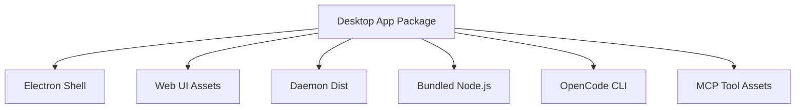

# Deployment View: System

**Date**: 2026-06-09
**Source ADRs**: ADR-001
**Status**: Generated from accepted ADRs

## Purpose

The system deployment view describes MyBoTeam as a single local desktop product
that contains multiple internal runtime units and bundled assets.

## Runtime Environments

| Runtime | Deployment Form |
|---------|-----------------|
| Web UI | Static renderer assets bundled into desktop package |
| Desktop Shell | Electron application process |
| Daemon | Bundled Node.js process launched by desktop |
| Agent Core | Shared package code bundled into desktop/daemon builds |
| MCP Tool Families | Extra resources invoked by OpenCode runtime |
| OpenCode | Bundled platform-specific CLI package |

## Deployment Topology

## Deployment Constraints

No hosted MyBoTeam backend is deployed. Packaged assets must be complete and
internally compatible. External dependencies are user-configured providers,
local model servers, release channels, and connector APIs.
