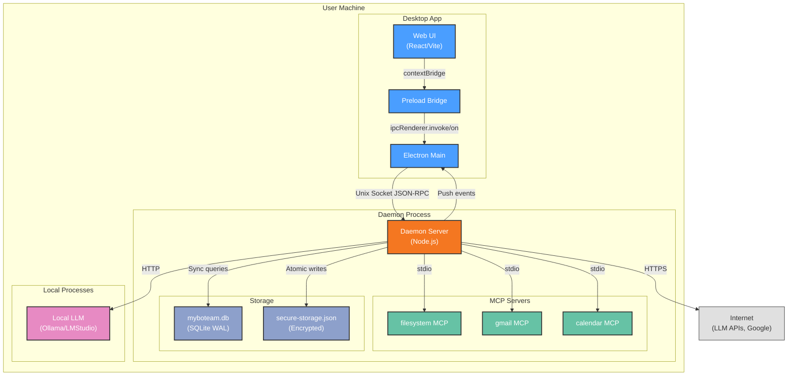

# Deployment View: System

**Sub-System**: System (Cross-cutting)
**ADRs Referenced**: ADR-001, ADR-007, ADR-008
**Generated**: 2026-06-24
**Dependencies**: Context View, Functional View

---

## 3.6 Deployment View

**Purpose**: Physical environment — nodes, networks, storage for the System sub-system

### 3.6.1 Runtime Environments

| Environment | Purpose | Infrastructure | Scale |
|-------------|---------|----------------|-------|
| Production | End-user desktop app (macOS/Windows) | Native desktop (no cloud) | Single user machine |
| Development | Local dev environment | macOS (pnpm + Vite + tsup watch) | 1 developer machine |
| CI | Automated testing | GitHub Actions (macOS + Ubuntu runners) | Ephemeral per PR |

### 3.6.2 Network Topology

### 3.6.3 Hardware Requirements

| Component | CPU | Memory | Storage | Notes |
|-----------|-----|--------|---------|-------|
| Desktop App (Electron) | 2 cores (Intel/Apple Silicon) | 2-4GB baseline | ~500MB app bundle | Shared with daemon |
| Daemon (Node.js) | 1-2 cores | ~50MB baseline, +10MB per MCP server | ~100MB (SQLite + vault) | Grows with usage |
| Local LLM (optional) | 4+ cores (Apple Silicon recommended) | 8-16GB (7B-13B models) | 4-12GB per model | User-managed via Ollama |

### 3.6.4 Third-Party Services

| Service | Purpose | Provider | Tier |
|---------|---------|----------|------|
| LLM Provider API | Agent intelligence | OpenAI/Anthropic (user BYOK) | Free-tier to paid (user choice) |
| Google Workspace | Email, calendar, docs | Google | Free-tier to Workspace |
| macOS App Store | Distribution + updates | Apple | Developer Program ($99/yr) |
| Microsoft Store | Distribution + updates | Microsoft | Partner Program (free) |

---

## Perspective Considerations

### Security Considerations

All communication within user machine (except BYOK LLM calls). Unix socket with filesystem permissions instead of network-bound ports. Renderer has zero socket/FS access. MCP server process isolation prevents cross-server attacks. Daemon runs as user process (no elevated privileges). Secrets encrypted at rest (ADR-001, ADR-004, ADR-008).

_Source ADRs: ADR-001, ADR-004, ADR-008_

### Performance Considerations

Local-first means zero network latency for core operations. Only LLM calls and Google Workspace integration require internet. Daemon as login item ensures persistent execution. Crash recovery marks stale tasks as failed (ADR-001, ADR-008).

_Source ADRs: ADR-001, ADR-008_

### Availability Considerations

Daemon survives window close (detached process). Reconnection with exponential backoff if socket drops. PID lock prevents multi-instance corruption. Login-item auto-start ensures daemon runs after reboot. No cloud dependency means no external downtime risk (ADR-001, ADR-008).

_Source ADRs: ADR-001, ADR-008_

---

**ADR Traceability:**

| ADR | Decision | Impact on Deployment View |
|-----|----------|----------------------------|
| ADR-001 | Layered IPC + Unix socket | Defines all deployment topology, IPC chain, reconnection |
| ADR-004 | better-sqlite3 + vault | Defines storage deployment within daemon process |
| ADR-008 | HITL + daemon resilience | Defines login item, crash recovery, PID lock |
