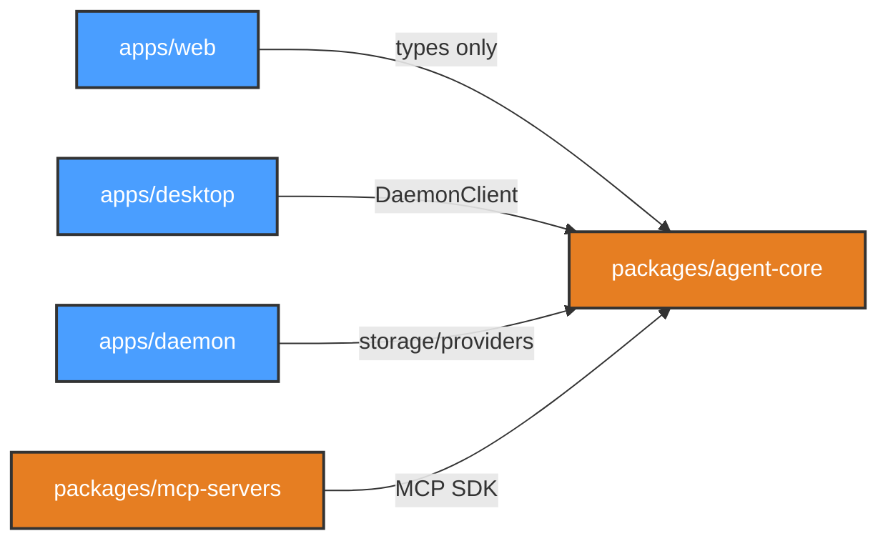

# Development View: System

**Sub-System**: System (Cross-cutting)
**ADRs Referenced**: ADR-001, ADR-007, ADR-008, ADR-011
**Generated**: 2026-06-24
**Dependencies**: Functional View

---

## 3.5 Development View

**Purpose**: Constraints for developers — code organization, dependencies, CI/CD for the System sub-system

### 3.5.1 Code Organization

```text
myboteam_v0.5.0/
├── apps/
│   ├── web/             @myboteam/web       — React UI (Vite + React Router + Zustand)
│   ├── desktop/         @myboteam/desktop    — Electron shell (main + preload)
│   └── daemon/          @myboteam/daemon     — Background daemon (Node.js)
├── packages/
│   ├── agent-core/      @myboteam/agent-core — Shared contracts, storage, Eve materializer
│   └── mcp-servers/     @myboteam/mcp-servers — Bundled MCP server packages
├── bundled-skills/                           — Shipped skill markdown files (read-only)
├── docs/                                     — Architecture docs, ADRs
├── scripts/                                  — Dev orchestrator, build helpers
├── tests/                                    — Multi-layer test suites
│   ├── unit/
│   ├── contract/
│   ├── integration/
│   ├── simulation/
│   └── e2e/
├── pnpm-workspace.yaml
├── tsconfig.base.json
└── package.json
```

### 3.5.2 Technology Stack Mapping

| Functional Role | Technology Choice | Version/Variant | ADR Reference |
|-----------------|-------------------|-----------------|---------------|
| Web Shell | React with Vite | React 18, Vite 5 | ADR-001 |
| Desktop Shell | Electron | Latest stable | ADR-001 |
| Background Daemon | Node.js (TypeScript) | Node 20 LTS | ADR-001 |
| IPC Protocol | JSON-RPC over Unix socket | — | ADR-001 |
| Inter-Process Communication | Electron contextBridge + IPC | — | ADR-001 |
| Build System | pnpm workspaces + tsup | pnpm 8+ | ADR-007 |
| Desktop Packaging | electron-builder | — | ADR-007 |
| Test Runner | Vitest workspace | — | ADR-011 |
| E2E Testing | Playwright | — | ADR-011 |
| UI State | Zustand | — | ADR-001 |

### 3.5.3 Technology Architecture

```mermaid
graph TD
    subgraph "Build Pipeline"
        pnpm["pnpm workspace"]
        Vite["Vite (Web)"]
        tsup["tsup (Daemon/MCP)"]
        EB["electron-builder"]
    end

    subgraph "Runtime"
        React["React 18"]
        Electron["Electron"]
        Node["Node 20 (Daemon)"]
    end

    subgraph "IPC"
        CB["contextBridge"]
        IPC["Electron IPC"]
        JRPC["JSON-RPC<br/>(Unix Socket)"]
    end

    subgraph "Test"
        Vitest["Vitest"]
        PW["Playwright"]
    end

    React -->|"Runs on"| Electron
    React -->|"API via"| CB
    CB -->|"invoke/on"| IPC
    IPC -->|"JSON-RPC client"| JRPC
    JRPC -->|"Server"| Node

    pnpm -->|"Builds"| Vite
    pnpm -->|"Builds"| tsup
    pnpm -->|"Packages"| EB
    EB -->|"Bundles"| Electron

    Vitest -->|"Unit/Integration"| pnpm
    PW -->|"E2E"| Electron

    classDef buildNode fill:#e67e22,stroke:#333,stroke-width:2px,color:#fff
    classDef runtimeNode fill:#4a9eff,stroke:#333,stroke-width:2px,color:#fff
    classDef ipcNode fill:#66c2a5,stroke:#333,stroke-width:2px,color:#fff
    classDef testNode fill:#8da0cb,stroke:#333,stroke-width:2px,color:#fff

    class pnpm,Vite,tsup,EB buildNode
    class React,Electron,Node runtimeNode
    class CB,IPC,JRPC ipcNode
    class Vitest,PW testNode
```

### 3.5.4 Module Dependencies

**Dependency Rules:**

- `apps/web` depends on `packages/agent-core` (types only, no Node.js)
- `apps/desktop` depends on `packages/agent-core` (DaemonClient, socket transport)
- `apps/daemon` depends on `packages/agent-core` (storage, providers, services)
- `packages/mcp-servers` depends on `@modelcontextprotocol/sdk`
- No app depends on another app
- Circular dependencies forbidden (enforced by ESLint)



### 3.5.5 Build & CI/CD

- **Build System**: pnpm workspaces with `--filter` for targeted builds
- **CI Pipeline**: lint → typecheck → unit tests → contract tests → integration tests → simulation tests → build → E2E tests → package
- **Deployment Strategy**: Direct distribution via app stores (no cloud deployment)
- **Release Process**: GitHub release → CI builds → Notarize (macOS) → Submit to stores

### 3.5.6 Development Standards

- **Coding Standards**: ESLint + Prettier, strict TypeScript (strict mode)
- **Review Requirements**: Constitution quality gates: 4-pillar assessment (Spec Compliance, Code Quality, Test Adequacy, Risk & Evidence), all ≥70 for PASS
- **Testing Requirements**: RED phase before implementation; contract + integration at boundaries; exhaustive CompletionEnforcer state tests

---

## Perspective Considerations

### Security Considerations

SAST (ESLint security rules) and dependency scanning in CI. No secrets in code (`.env` files excluded from repo). electron-builder handles code signing. Review gate before merge ensures security review. Chromium sandbox in Electron prevents renderer compromise (ADR-001, ADR-008).

_Source ADRs: ADR-001, ADR-008_

### Performance Considerations

Build times: pnpm filtered builds parallelize by package. Vitest watch mode for TDD. Dev mode: Vite HMR for web, `tsx --watch` for daemon. electron-builder packaging: ~2-3 min (ADR-007).

_Source ADRs: ADR-007_

---

**ADR Traceability:**

| ADR | Decision | Impact on Development View |
|-----|----------|----------------------------|
| ADR-001 | Layered architecture | Defines app structure, IPC tech choices |
| ADR-007 | Monorepo structure | Defines code organization, build system, dependency rules |
| ADR-011 | Test architecture | Defines test organization, frameworks, coverage requirements |
