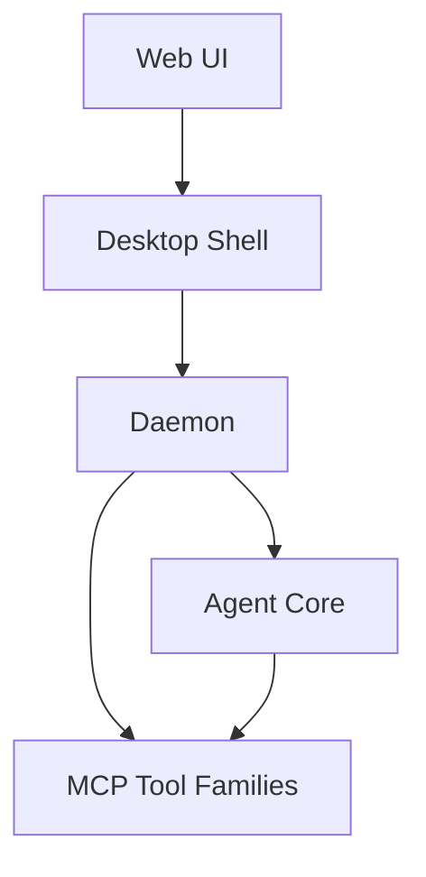

# Functional View: System

**Date**: 2026-06-09
**Source ADRs**: ADR-001
**Status**: Generated from accepted ADRs

## Purpose

The Functional view identifies the product-level component boundaries that shape
all other architecture views. MyBoTeam is a local-first desktop product with
separate packages for UI, shell, execution, shared core, and bundled tools.

## Functional Elements

| Element | Responsibility |
|---------|----------------|
| Web UI | Presents tasks, settings, history, provider selection, and status |
| Desktop Shell | Owns windows, tray, preload, packaging, updater, and OS bridges |
| Daemon | Owns task execution, storage, secrets, connectors, and background services |
| Agent Core | Provides shared types, storage, providers, daemon transports, and factories |
| MCP Tool Families | Provide bundled tool capabilities to OpenCode runtimes |

## Interaction Diagram

## Functional Boundaries

Desktop shell code must not become connector or task-domain owner. Daemon code
must not become UI or packaging owner. Agent Core is shared implementation and
contract code, not a runtime product by itself.
