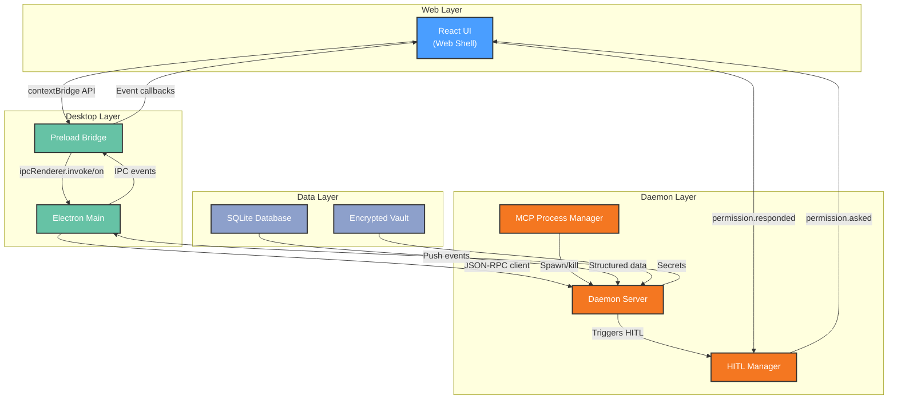

# Functional View: System

**Sub-System**: System (Cross-cutting)
**ADRs Referenced**: ADR-001, ADR-007, ADR-008, ADR-011
**Generated**: 2026-06-24
**Dependencies**: Context View

---

## 3.2 Functional View

**Purpose**: Describe functional elements, their responsibilities, and interactions for the System sub-system

### 3.2.1 Functional Elements

| Element | Responsibility | Interfaces Provided | Dependencies |
|---------|----------------|---------------------|--------------|
| React UI (Web Shell) | Renders chat UI, settings, agent status, HITL prompts | `window.myboteam.*` typed API (contextBridge) | Electron Main (IPC) |
| Preload Bridge | Sole bridge between web and native; exposes typed API | `ipcRenderer.invoke`, `ipcRenderer.on` | Electron Main |
| Electron Main | Window lifecycle, OS bridges, packaging | IPC handler, socket client, menu/tray | Daemon (JSON-RPC) |
| Daemon Server | JSON-RPC server, service orchestration, IPC router | JSON-RPC methods, push notifications | Unix socket |
| HITL Manager | Manages permission request lifecycle, timeout enforcement | `permission.asked`, `permission.responded` events | Daemon, Web UI |
| MCP Process Manager | Spawns/kills MCP server child processes, enforces sandbox | Process lifecycle API | Daemon (child_process) |
| Test Runner | Orchestrates multi-layer test execution | Vitest config, CI gate | All packages |
| IPC Communication Bus | Bidirectional event streaming across process boundaries | JSON-RPC methods, event push | Unix socket |

### 3.2.2 Element Interactions

### 3.2.3 Functional Boundaries

**What this system DOES:**

- Render chat UI with agent interaction, task status, and settings
- Manage Electron window lifecycle (create, minimize, close, tray)
- Run background daemon that survives window close
- Enforce strict 4-link IPC chain (web → preload → main → daemon)
- Handle HITL permission requests with 5-min auto-reject timeout
- Spawn/terminate MCP server child processes with process isolation
- Coordinate multi-layer test execution (unit/contract/integration/simulation/E2E)
- Log all verification results and tool calls to debug_logs

**What this system does NOT do:**

- Does NOT expose Node.js or filesystem APIs to the renderer
- Does NOT run agent logic in the renderer or main process
- Does NOT provide cloud-based HITL or mobile notification
- Does NOT store secrets in the renderer process or logs

---

## Perspective Considerations

### Security Considerations

4-link chain ensures renderer has zero filesystem/socket access. HITL triggers before sensitive actions (email, external calendar, files outside workspace). MCP sandboxing with process isolation prevents cross-server escalation. Sensitive paths always blocked: `.ssh`, `.env`, `.gnupg`, `.gitconfig`. App store compliance through user-initiated design (ADR-001, ADR-008).

_Source ADRs: ADR-001, ADR-008_

### Performance Considerations

Unix socket JSON-RPC provides sub-millisecond IPC. Daemon reconnection with exponential backoff (200ms → 5000ms). Memory: daemon ~50MB baseline, +10MB per MCP server. Startup: Electron shell ~1s, daemon ~500ms (ADR-001, ADR-007).

_Source ADRs: ADR-001, ADR-007_

### Evolution Considerations

Monorepo structure (ADR-007) enables independent package evolution. New agent types added via SQLite record + materialization — no core changes. Plugin SDK deferred to post-MVP (PDR-010). Test architecture (ADR-011) ensures regressions are caught during evolution.

_Source ADRs: ADR-007, ADR-011_

### Usability Considerations

Solopreneur target persona: one-click onboarding, single LLM provider setup, no cron expression knowledge required. HITL prompts shown in-chat with clear Approve/Modify/Reject buttons. Desktop notifications for background HITL requests (ADR-008).

_Source ADRs: ADR-008_

---

## Validation Checklist

- [x] **Technology Neutrality**: All elements described by architectural role
- [x] **Diagram Consistency**: Mermaid diagram uses generic labels matching the element table
- [x] **Interface Abstraction**: Interfaces describe capabilities, not implementation protocols
- [x] **Complete Coverage**: All major functional responsibilities represented
- [x] **Clear Boundaries**: "What system DOES" and "does NOT do" clearly articulated

---

**ADR Traceability:**

| ADR | Decision | Impact on Functional View |
|-----|----------|---------------------------|
| ADR-001 | Layered 4-link IPC chain | Defines all communication elements and boundaries |
| ADR-007 | Monorepo structure | Determines code organization and ownership boundaries |
| ADR-008 | HITL + MCP sandboxing | Adds HITL Manager and MCP Process Manager elements |
| ADR-011 | Multi-layer test architecture | Defines Test Runner element and test organization |
