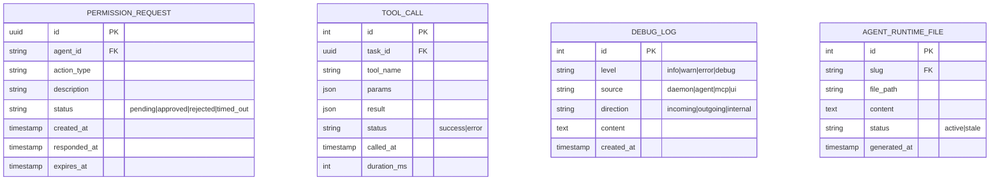

# Information View: System

**Sub-System**: System (Cross-cutting)
**ADRs Referenced**: ADR-001, ADR-007, ADR-008, ADR-011, ADR-004
**Generated**: 2026-06-24
**Dependencies**: Functional View

---

## 3.3 Information View

**Purpose**: Describe data storage, management, and flow for the System sub-system

### 3.3.1 Data Entities

| Entity | Storage Location | Owner Component | Lifecycle | Access Pattern |
|--------|------------------|-----------------|-----------|----------------|
| IPC Message Payloads | In-memory (transient) | JSON-RPC router | Ephemeral (per request) | Write-once, read-once |
| HITL Permission Requests | SQLite (permission_requests) | HITL Manager | Create → Respond → Archive | Write-once, read-pending |
| Tool Call Logs | SQLite (tool_calls) | Daemon Services | Append-only, rotated | Write-heavy |
| Debug Logs | SQLite (debug_logs) | Daemon Services | Append-only, rotated | Write-heavy |
| Agent Runtime Files | File System (`.local-data/agents/{slug}/`) | Agent Materializer | Persist until regeneration | Read-on-materialize |
| Test Results | CI artifacts (ephemeral) | Test Runner | Ephemeral (per CI run) | Write-once |

### 3.3.2 Data Model

### 3.3.3 Data Flow

**Key Data Flows:**

1. **HITL Request Flow**: Agent attempts sensitive action → Daemon creates permission_request record → UI notification (polling via event push) → User responds → Daemon updates record → Agent resumes/cancelled
2. **Tool Call Logging Flow**: Agent calls tool → Daemon executes → Result logged to tool_calls table → Debug_logs updated with direction metadata
3. **Agent Materialization Flow**: User/Orchestrator triggers agent → Materializer reads AgentDefinition from SQLite → Generates files on disk → Files marked stale on config change

### 3.3.4 Data Quality & Integrity

- **Consistency Model**: Strong (SQLite ACID)
- **Validation Rules**: JSON-RPC payloads validated at each process boundary; typed contracts prevent silent corruption
- **Retention Policy**: Debug logs rotated (configurable, default 30 days); tool calls retained indefinitely for audit
- **Backup Strategy**: Data directory (`~/.myboteam/`) is fully portable; user backs up entire directory

---

## Perspective Considerations

### Security Considerations

IPC payloads contain only validated, typed data — no raw user code. HITL records track approval trail. Debug logs exclude secrets (filtered at source). Agent runtime files on disk are inspectable and auditable. PID lock prevents daemon multi-instance data corruption (ADR-001, ADR-004, ADR-008).

_Source ADRs: ADR-001, ADR-004, ADR-008_

### Performance Considerations

JSON-RPC payload serialization overhead minimal (<1ms). SQLite WAL mode enables concurrent reads. Debug log rotation prevents unbounded growth. Agent file generation adds 50-100ms per materialization. In-memory IPC payloads have zero persistence cost (ADR-001, ADR-004).

_Source ADRs: ADR-001, ADR-004, ADR-007_

---

**ADR Traceability:**

| ADR | Decision | Impact on Information View |
|-----|----------|----------------------------|
| ADR-001 | Layered IPC with typed payloads | Defines IPC message format and validation |
| ADR-004 | better-sqlite3 + vault | Defines all storage entities and lifecycle |
| ADR-008 | HITL with permission tracking | Defines permission_requests entity |
| ADR-011 | Test architecture | Defines test result data (ephemeral) |
