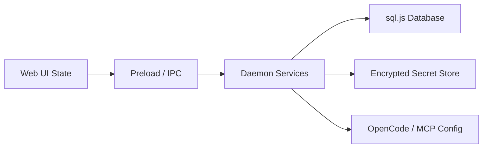

# Information View: System

**Date**: 2026-06-09
**Source ADRs**: ADR-001
**Status**: Generated from accepted ADRs

## Purpose

The system-level information view describes how local data responsibilities are
distributed across MyBoTeam sub-systems. The authoritative persistent data owner
is the daemon through agent-core storage primitives.

## Information Elements

| Element | Owner | Description |
|---------|-------|-------------|
| Task Records | Daemon | Task lifecycle, status, prompts, and summaries |
| Task Messages | Daemon | User, assistant, tool, and status messages |
| Provider Settings | Daemon | Active provider and model configuration |
| Secrets | Daemon | API keys, OAuth tokens, and connector tokens |
| UI State | Web | Transient renderer state derived from daemon events |
| Tool Config | Agent Core / MCP | Generated OpenCode and MCP runtime configuration |

## Data Flow

## Information Constraints

Secrets and task data stay local by default. Cross-boundary payloads are
validated before persistence. Schema evolution follows immutable migration
history with tested `up` and `down` paths.
