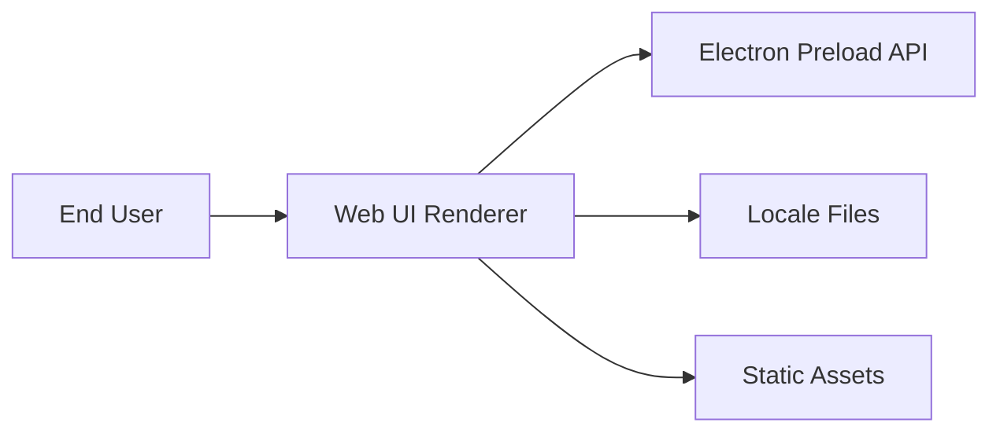

# Context View: Web

**Date**: 2026-06-09
**Source ADRs**: ADR-002
**Status**: Generated from accepted ADRs

## Purpose

The Web sub-system is the renderer-facing UI package. It runs inside the
Electron renderer process in the desktop product and consumes a typed preload API
rather than direct Node.js capabilities.

## External Entities

| Entity | Type | Relationship |
|--------|------|--------------|
| End User | Human actor | Interacts with task launcher, settings, history, and task views |
| Electron Preload API | Local privileged boundary | Exposes `window.myboteam` capabilities |
| i18n Resources | Local assets | Provide localized strings and RTL/LTR layout behavior |
| Static Assets | Local assets | Provide images, fonts, icons, and provider logos |

## Context Diagram

## Constraints

The renderer is not a privileged runtime. It must call typed APIs exposed through
preload wrappers, keep renderer state in UI stores, and treat all responses from
process boundaries as data that still needs UI-safe handling.
