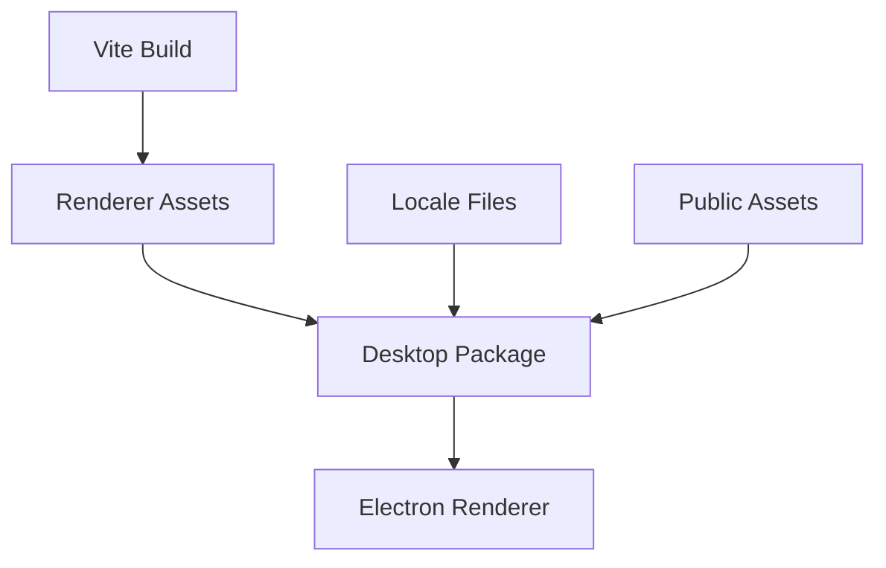

# Deployment View: Web

**Date**: 2026-06-09
**Source ADRs**: ADR-002
**Status**: Generated from accepted ADRs

## Purpose

The Web sub-system deploys as static renderer assets. In production it is loaded
by the Electron shell rather than served from a remote web backend.

## Runtime Environments

| Environment | Description |
|-------------|-------------|
| Development | Vite dev server for renderer iteration |
| Packaged Desktop | Static `apps/web/dist/client` assets bundled into desktop resources |
| Test | jsdom/Vitest and Electron E2E contexts |
| Local Assets | Fonts, images, locales, and provider logos bundled with app resources |

## Deployment Topology

## Deployment Constraints

Web assets must avoid absolute image paths that break packaged builds. Runtime
privileged behavior depends on preload APIs supplied by the desktop shell, not
on browser-hosted services.
