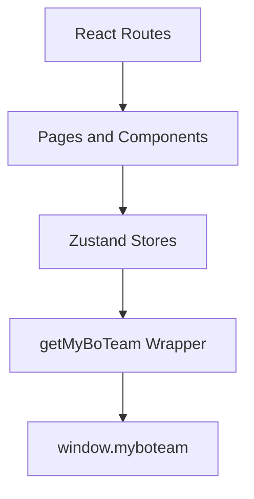

# Functional View: Web

**Date**: 2026-06-09
**Source ADRs**: ADR-002
**Status**: Generated from accepted ADRs

## Purpose

The Web sub-system provides the renderer experience. It owns user-facing state,
routes, pages, and components while delegating privileged operations to typed
preload APIs.

## Functional Elements

| Element | Responsibility |
|---------|----------------|
| React Routes | Map application pages and execution views |
| Zustand Stores | Hold task, workspace, daemon, account, and UI state |
| `getMyBoTeam` Wrapper | Provides typed access to `window.myboteam` |
| Task Views | Show task progress, messages, permissions, todos, and follow-ups |
| Settings Views | Configure providers, agents, skills, connectors, and preferences |
| i18n Layer | Loads locale resources and direction-aware UI text |

## Interaction Diagram

## Functional Boundaries

Web code must not directly access Node.js, filesystem, daemon sockets, or
provider secrets. It consumes shared contract types and renders local state from
preload/daemon events.
