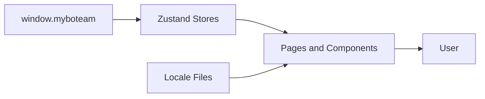

# Information View: Web

**Date**: 2026-06-09
**Source ADRs**: ADR-002
**Status**: Generated from accepted ADRs

## Purpose

The Web sub-system manages transient renderer information. Durable data comes
from daemon APIs and is reflected into Zustand stores and component props.

## Information Elements

| Element | Source | Description |
|---------|--------|-------------|
| Current Task | Daemon events/API | Active task and execution status |
| Task History | Daemon storage API | Historical task list and details |
| Permission Requests | Daemon events | User approval prompts for tool actions |
| Todos | Daemon events/storage | Task-generated todo state |
| Provider Selection | Daemon settings | Active model and provider choices |
| Locale State | Local resources | Current language, translation keys, and layout direction |

## Data Flow

## Information Constraints

Web state is not the source of truth for secrets or durable task data. Renderer
code must avoid storing decrypted secrets and must treat daemon responses as
data to validate before display or action.
