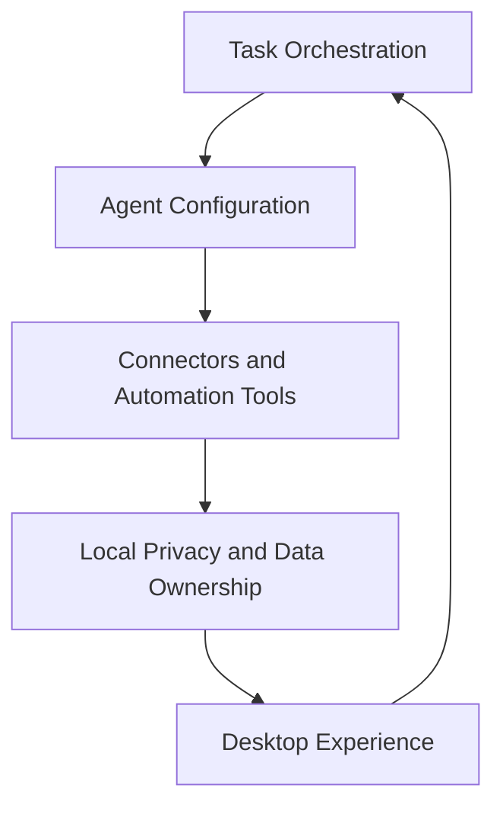

# Product Decision Records

Generated by `/product.init` from brownfield product analysis on 2026-06-10.

## Discovery Context

**Source**: Existing MyBoTeam repository and configured team directives.
**Team Product Directives baseline**:
`/Users/mavishay/Projects/MaorInnovations/team-ai-directives`.

The configured directives repository contains team personas under
`context_modules/personas`, but no `product_modules/pdrs` or `pricing_models`
directories were found. Product/pricing comparison therefore treats team PDRs
and pricing models as empty baselines.

## Clarification Decisions Applied

- Add structured `Alternatives Considered`, `Risks and Mitigations`, and
  `Success Metrics` sections to all PDRs.
- Primary segment is broad and simple-user oriented, not mainly professional.
- Default autonomy is guardrailed, with a configurable higher-autonomy mode.
- Product success priority is task completion rate first, retained users second,
  and automation depth third.
- Current scope includes free built-in skills that ship with the app.
- Roadmap scope includes curated in-app bundles and a downloadable marketplace.
- Monetization direction is future marketplace revenue through curated bundles
  of agents, skills, and workflows.
- Current locale commitments match the existing locale set; Hebrew/RTL is
  roadmap scope.
- Onboarding should start in guided simple mode.
- First-run focus is everyday personal productivity, personal digital assistant
  tasks, and communication/coordination flows.
- Workspaces are an advanced feature and should stay mostly hidden from
  first-run users.
- Provider setup remains required in current scope, but onboarding should delay
  and simplify it as much as possible.
- Scheduling is advanced and should usually be accessed by asking the agent,
  while explicit schedule dashboards remain power-user surfaces.
- Voice is a secondary convenience feature introduced after initial task
  success.
- Browser automation should stay mostly behind the scenes and be framed through
  outcomes rather than mechanisms.
- Email, calendar, and messaging are equal first-wave communication channels.
- File and document help is a major first-wave capability framed through
  everyday outcomes such as summarizing, organizing, sharing, and drafting.
- Agent language should remain visible, but in simple consumer terms.
- Trust/privacy is a strong secondary message after usefulness and simplicity.
- Examples are a secondary discovery tool, not the main onboarding mechanic.
- Task completion is defined by user-confirmed usefulness.
- Retention should come from reliability, convenience, and habit loops.
- Failure handling should optimize for clear recovery guidance.
- Follow-ups, reminders, and communication updates are all intended re-entry
  points.
- Communication actions should default to conservative behavior with optional
  more direct execution later.

## Feature Areas Analyzed

| ID | Feature-Area | Sources | Evidence |
|----|--------------|---------|----------|
| task-orchestration | Task Orchestration | Docs, UI, daemon, storage | README task positioning, execution pages, task store/actions, daemon task service, task tables |
| agent-configuration | Agent Configuration | Docs, UI, core | Provider and skills settings, OpenCode config, provider storage |
| connectors-automation-tools | Connectors and Automation Tools | Docs, daemon, MCP packages | Google/Gmail/Calendar, WhatsApp, browser automation, connector-auth tools |
| local-privacy-data-ownership | Local Privacy and Data Ownership | Docs, ADRs, storage | local-first claims, vault/secrets, sql.js, encrypted storage, no hosted backend |
| desktop-experience | Desktop Experience | Docs, UI, desktop shell | Electron package, settings pages, themes, locales, workspaces, scheduler |

## PDR Index

| ID | Feature-Area | Category | Cross-Area | Status | Date |
|----|--------------|----------|------------|--------|------|
| PDR-001 | cross-area | Positioning | Yes | Accepted | 2026-06-10 |
| PDR-002 | task-orchestration | Workflow Model | Yes | Accepted | 2026-06-10 |
| PDR-003 | agent-configuration | Product Capability | Yes | Accepted | 2026-06-10 |
| PDR-004 | connectors-automation-tools | Product Capability | Yes | Accepted | 2026-06-10 |
| PDR-005 | local-privacy-data-ownership | Trust Model | Yes | Accepted | 2026-06-10 |
| PDR-006 | task-orchestration | Safety and Control | Yes | Accepted | 2026-06-10 |
| PDR-007 | connectors-automation-tools | Differentiation | Yes | Accepted | 2026-06-10 |
| PDR-008 | cross-area | Business Model | Yes | Accepted | 2026-06-10 |
| PDR-009 | desktop-experience | User Experience | Yes | Accepted | 2026-06-10 |

---

## Cross-Feature-Area Analysis Summary

### Cross-Area Patterns

| Pattern | Feature-Areas | PDR |
|---------|---------------|-----|
| Personal AI workforce, not chatbot | task-orchestration, agent-configuration, connectors-automation-tools, desktop-experience | PDR-001 |
| Task-first autonomous workflow | task-orchestration, agent-configuration, desktop-experience | PDR-002 |
| Provider-neutral AI gateway | agent-configuration, local-privacy-data-ownership, task-orchestration | PDR-003 |
| Skills, MCP, and connector extensibility | agent-configuration, connectors-automation-tools, desktop-experience | PDR-004 |
| Local-first trust and data ownership | local-privacy-data-ownership, task-orchestration, connectors-automation-tools, desktop-experience | PDR-005 |
| Human-in-loop automation control | task-orchestration, connectors-automation-tools, local-privacy-data-ownership | PDR-006 |
| Native desktop and browser automation | connectors-automation-tools, desktop-experience, task-orchestration | PDR-007 |
| Configurable personal desktop app | desktop-experience, agent-configuration, local-privacy-data-ownership | PDR-009 |

### Clarifications Applied

| Clarification | PDRs Affected | Resolution |
|---------------|---------------|------------|
| Monetization direction | PDR-008 | Curated bundles are the future revenue model |
| Marketplace scope | PDR-004, PDR-007 | Built-in free skills are current; downloadable marketplace is roadmap |
| i18n scope | PDR-009 | Current locales stay explicit; Hebrew/RTL is roadmap |
| User segment | PDR-001, PDR-009 | Broad simple users are the primary audience |
| Autonomy model | PDR-006 | Guardrailed by default, higher autonomy configurable |
| First-run use cases | PDR-001, PDR-002, PDR-009 | Prioritize productivity, assistant, and communication outcomes |
| Communication trust model | PDR-006, PDR-009 | Conservative by default, configurable later |
| Completion metric | PDR-002, PDR-006 | Success is user-confirmed usefulness |

### Discovery Visualization

---

## PDR-001: Position MyBoTeam as a Personal AI Workforce

**Status**: Accepted
**Feature-Area**: cross-area
**Category**: Positioning
**Strategic Importance**: 0.92
**Date**: 2026-06-10

### Cross-Feature-Area Metadata

- **Appears in**: task-orchestration, agent-configuration,
  connectors-automation-tools, desktop-experience
- **Cross-area count**: 4
- **Is cross-area pattern**: Yes

### Decision

MyBoTeam is positioned as a private team of specialized AI agents that users
collaborate with to complete workflows, rather than as a general chat
application.

### Evidence

- README headline: "Your private AI team, running locally on your desktop".
- README contrasts collaborating with an autonomous workforce against chatting
  with an AI.
- Product routes prioritize home task input, conversations, favorites, examples,
  and execution pages.
- Agent configuration, skills, providers, and MCP tools are exposed as product
  configuration surfaces.

### Rationale

The product promise depends on moving beyond isolated chat sessions. This
positioning justifies task history, execution state, specialized skills,
connector tools, and desktop automation as core product surfaces. The first-run
experience should emphasize everyday productivity, assistant tasks, and
communication outcomes for broad simple users.

### Consequences

- **Positive**: Product language can consistently describe advanced AI
  capability in simple-user terms without collapsing the experience into a
  generic chatbot.
- **Positive**: Chat UI remains useful as an interaction surface while task
  completion stays the product anchor.
- **Negative**: "AI workforce" language can overpromise autonomy if onboarding
  and permissions feel too technical for simple users.
- **Negative**: Broad audience positioning can dilute feature prioritization if
  the product does not keep a simple-user default path.

### Alternatives Considered

- **General-purpose chatbot positioning**: easier to explain, but weaker
  differentiation and less aligned with the task/runtime architecture.
- **Professional-only operator tool**: clearer for enterprise or technical
  users, but conflicts with the chosen simple-user direction.
- **Invisible assistant with no agent language**: simpler, but weaker fit with
  future curated bundles and capability explainability.

### Risks and Mitigations

- **Risk**: Positioning sounds too advanced for casual users.
  **Mitigation**: guided simple onboarding and plain-language task entry.
- **Risk**: Users expect fully autonomous behavior immediately.
  **Mitigation**: default to guardrailed autonomy and expose stronger autonomy
  as configuration.

### Success Metrics

- **Primary**: task completion rate for user-requested tasks.
- **Secondary**: weekly retained users who run repeat tasks.
- **Tertiary**: automation depth, measured by the share of tasks completed with
  fewer manual interventions over time.

### Clarification Resolution

- **Resolved**: The primary audience is broad simple users rather than mainly
  professionals.
- **Resolved**: The first-run product focus is productivity, assistant, and
  communication outcomes.
- **Resolved**: "Agent" remains visible language, but in simple consumer terms.

### Team-TPD Comparison

- **Team-product-directives match**: Partial
- **Similar patterns**: team personas cover engineering/data roles, but no
  product PDRs were found.
- **Gap identified**: Yes, this positioning should become canonical product
  context.

### Inconsistency Flags

None.

---

## PDR-002: Make Task Execution the Primary Workflow Unit

**Status**: Accepted
**Feature-Area**: task-orchestration
**Category**: Workflow Model
**Strategic Importance**: 0.95
**Date**: 2026-06-10

### Cross-Feature-Area Metadata

- **Appears in**: task-orchestration, agent-configuration, desktop-experience
- **Cross-area count**: 3
- **Is cross-area pattern**: Yes

### Decision

User work is modeled around tasks with lifecycle, messages, attachments, todos,
permissions, status, history, favorites, and scheduled execution.

### Evidence

- Routes include `/execution/:id`, conversations, favorites, examples, and home.
- `ExecutionPage` renders task state, permission requests, follow-up input,
  debug logs, todos, browser preview, and completion footer.
- Storage defines `tasks`, `task_messages`, `task_attachments`,
  `task_todos`, `task_favorites`, and `scheduled_tasks`.
- Daemon services own task start, cancel, resume, event forwarding, storage,
  and OpenCode runtime interaction.

### Rationale

Task-first design gives the product a durable unit for automation, review,
continuation, favorites, scheduling, and model/provider context. A task is
successful when the user considers the result useful enough, even if the flow
was partially assisted rather than fully autonomous.

### Consequences

- **Positive**: Tasks unify execution, history, permissions, follow-ups,
  summaries, favorites, and scheduling under one user-facing object.
- **Positive**: Task identity makes it easier to optimize for completion rate,
  which is the primary success metric.
- **Negative**: Simple users may not naturally think in task lifecycle terms if
  the UI exposes too much internal state.
- **Negative**: Cross-task workflows can feel fragmented if the product does not
  provide good handoff and continuation affordances.

### Alternatives Considered

- **Conversation-first model**: familiar to users, but weaker for scheduling,
  resumability, and workflow accountability.
- **Workspace-first model**: good for long-running projects, but less direct for
  the simple-user "describe a task" entry point.
- **Persistent assistant thread model**: simpler for chat continuity, but
  weaker for reminders, scheduling, and explicit task outcomes.

### Risks and Mitigations

- **Risk**: The task model feels operational instead of simple.
  **Mitigation**: keep the first-run experience centered on plain-language task
  prompts rather than lifecycle controls.
- **Risk**: Users lose context across related tasks.
  **Mitigation**: preserve follow-ups, summaries, favorites, and history as
  continuity features.
- **Risk**: Scheduling and workspace concepts add too much first-run complexity.
  **Mitigation**: keep scheduling advanced and hide workspace management from
  most first-run users.

### Success Metrics

- **Primary**: user-confirmed useful task completion rate.
- **Secondary**: retained users who create and complete repeat tasks.
- **Tertiary**: average reduction in user interruptions per completed task.

### Clarification Resolution

- **Resolved**: Workspaces are advanced and mostly hidden from first-run users.
- **Resolved**: Scheduling is advanced, usually accessed by asking the agent.
- **Resolved**: Task completion is defined by user-confirmed usefulness.

### Team-TPD Comparison

- **Team-product-directives match**: None
- **Similar patterns**: none found in product modules.
- **Gap identified**: Yes.

### Inconsistency Flags

None.

---

## PDR-003: Support a Provider-Neutral AI Gateway

**Status**: Accepted
**Feature-Area**: agent-configuration
**Category**: Product Capability
**Strategic Importance**: 0.89
**Date**: 2026-06-10

### Cross-Feature-Area Metadata

- **Appears in**: agent-configuration, local-privacy-data-ownership,
  task-orchestration
- **Cross-area count**: 3
- **Is cross-area pattern**: Yes

### Decision

MyBoTeam lets users configure model providers and models instead of binding the
product to one hosted AI provider.

### Evidence

- README lists OpenAI, Anthropic, Google, Azure, Bedrock, OpenRouter, DeepSeek,
  Ollama, LM Studio, and custom OpenAI-compatible providers.
- Settings routes include a providers page.
- Provider storage persists provider connection status, selected model,
  credential type/data, available models, custom base URL, and active provider.
- OpenCode configuration receives active provider/model context for task
  runtimes.

### Rationale

Provider choice reinforces local-first trust, supports local model usage, and
reduces product dependency on a single AI vendor.

### Consequences

- **Positive**: Users can choose hosted or local models without the product
  locking them into one provider.
- **Positive**: Local model support aligns with the privacy and ownership story.
- **Negative**: Provider setup can overwhelm simple users if exposed too early.
- **Negative**: Model and credentials complexity increases support burden and
  failure modes.

### Alternatives Considered

- **Single-provider default**: simpler onboarding, but weaker local-first and
  weaker long-term flexibility.
- **Hosted managed gateway**: simpler for novices, but conflicts with the local
  privacy model and adds backend dependency.

### Risks and Mitigations

- **Risk**: Simple users bounce during provider setup.
  **Mitigation**: guided simple onboarding that defers advanced provider options.
- **Risk**: Provider failures erode trust.
  **Mitigation**: surface diagnostics and keep provider state explicit in
  settings.
- **Risk**: Provider setup remains a blocker for simple users because there is
  no zero-setup default yet.
  **Mitigation**: delay provider choice until needed and minimize setup steps.

### Success Metrics

- **Primary**: task completion rate after provider connection.
- **Secondary**: retained users who continue running tasks after first provider
  setup.
- **Tertiary**: increased share of users successfully using more autonomous task
  flows after initial setup.

### Clarification Resolution

- **Resolved**: Current scope still requires provider setup.
- **Resolved**: Onboarding should delay and simplify provider setup as much as
  possible.

### Team-TPD Comparison

- **Team-product-directives match**: None
- **Similar patterns**: none found in product modules.
- **Gap identified**: Yes.

### Inconsistency Flags

None.

---

## PDR-004: Treat Skills, MCP Tools, and Connectors as Extensibility Primitives

**Status**: Accepted
**Feature-Area**: connectors-automation-tools
**Category**: Product Capability
**Strategic Importance**: 0.91
**Date**: 2026-06-10

### Cross-Feature-Area Metadata

- **Appears in**: agent-configuration, connectors-automation-tools,
  desktop-experience
- **Cross-area count**: 3
- **Is cross-area pattern**: Yes

### Decision

MyBoTeam extends agent capability through configurable skills, MCP servers, and
first-party connector tool families.

### Evidence

- README lists agent management, skills, and MCP server management.
- Settings routes include skills, browsers, integrations, providers, and
  workspaces.
- Desktop bundles skills such as Google Workspace, code review, download-file,
  skill creator, and web research.
- Agent-core MCP packages include browser automation, Gmail, Calendar, Google
  Workspace, WhatsApp, start-task, complete-task, and connector-auth helpers.
- Architecture documents define bundled first-party MCP tool families as
  desktop-packaged assets injected into OpenCode runtimes.

### Rationale

Extensibility is how the product moves from a generic assistant to a specialized
automation team for user workflows, but current scope should expose built-in
skills primarily through simple outcomes rather than through raw capability
catalogs.

### Consequences

- **Positive**: Built-in free skills can demonstrate product value without
  requiring a marketplace or plugin hunt.
- **Positive**: Connector-family separation keeps ownership and diagnostics
  understandable.
- **Negative**: Too much extensibility exposed upfront can confuse the target
  simple user.
- **Negative**: Roadmap language around marketplace and catalogs can be mistaken
  for current product scope.

### Alternatives Considered

- **Monolithic built-in capability set only**: simpler current UX, but weaker
  long-term specialization story.
- **Downloadable marketplace now**: stronger commercial story sooner, but not
  supported clearly enough by the present product surface.
- **Open plugin ecosystem first**: flexible for technical users, but a worse fit
  for guided simple-user onboarding.

### Risks and Mitigations

- **Risk**: Users cannot tell what is built in versus future marketplace scope.
  **Mitigation**: describe current free built-in skills separately from roadmap
  bundle distribution.
- **Risk**: Skills and connectors remain too technical.
  **Mitigation**: expose them through guided onboarding and simple use-case
  paths before exposing raw configuration.
- **Risk**: Examples and built-in skills fail to activate simple users because
  they feel like optional demos.
  **Mitigation**: keep examples secondary, while ensuring built-in skills power
  real first-run tasks behind the scenes.

### Success Metrics

- **Primary**: task completion rate for tasks that rely on built-in skills or
  connector tools.
- **Secondary**: retained users who reuse built-in capabilities across weeks.
- **Tertiary**: growth in multi-step tasks completed with fewer manual tool
  interventions.

### Team-TPD Comparison

- **Team-product-directives match**: Partial
- **Similar patterns**: team directives include skills and personas, but no
  product PDRs.
- **Gap identified**: Yes.

### Clarification Resolution

- **Resolved**: Current scope is free built-in skills that ship with the app.
- **Resolved**: Curated in-app catalogs and downloadable marketplace bundles are
  roadmap scope, not current commitments.
- **Resolved**: Built-in skills are free core capabilities, not the current
  product's main onboarding story.

---

## PDR-005: Preserve Local-First Privacy and User Data Ownership

**Status**: Accepted
**Feature-Area**: local-privacy-data-ownership
**Category**: Trust Model
**Strategic Importance**: 0.98
**Date**: 2026-06-10

### Cross-Feature-Area Metadata

- **Appears in**: local-privacy-data-ownership, task-orchestration,
  connectors-automation-tools, desktop-experience
- **Cross-area count**: 4
- **Is cross-area pattern**: Yes

### Decision

MyBoTeam's product trust model is local-first: credentials, task history,
settings, connector tokens, and sensitive workflow data stay on the user's
machine unless the user explicitly configures an external provider or connector.

### Evidence

- README states local-first privacy, no cloud dependency, no telemetry without
  explicit consent, and full data ownership.
- Architecture states there is no hosted MyBoTeam backend.
- ADRs assign storage, secrets, provider settings, connector token lifecycle,
  and task execution to local daemon services.
- Storage uses local sql.js tables and encrypted file secrets.
- Constitution requires credentials and sensitive user data to stay local unless
  externally configured by the user.

### Rationale

The product asks users to trust automation with desktop workflows and
credentials. Local-first operation is therefore a product differentiator and a
trust prerequisite.

### Consequences

- **Positive**: Strong trust positioning differentiates the product from
  cloud-default assistants.
- **Positive**: Local ownership supports privacy-sensitive tasks and local-model
  use.
- **Negative**: Local-first architecture increases setup, recovery, and support
  complexity.
- **Negative**: Users still bear more responsibility for backup and migration
  than in hosted products.

### Alternatives Considered

- **Hosted backend with synced state**: simpler recovery and onboarding, but
  incompatible with the current privacy model.
- **Cloud-default assistant with optional local mode**: easier mainstream path,
  but weaker trust differentiation.

### Risks and Mitigations

- **Risk**: Local-first setup feels too technical for simple users.
  **Mitigation**: guided onboarding and sane defaults that hide advanced setup.
- **Risk**: Recovery and export gaps weaken trust.
  **Mitigation**: keep backup/export/import as explicit product roadmap work.
- **Risk**: Privacy messaging is too technical for simple users.
  **Mitigation**: lead with usefulness and simplicity, then reinforce local
  control and privacy.

### Success Metrics

- **Primary**: task completion rate without requiring hosted MyBoTeam services.
- **Secondary**: retained users who continue using the local product after first
  setup.
- **Tertiary**: increased share of completed tasks handled through the local app
  with minimal external-product dependency beyond chosen providers.

### Clarification Resolution

- **Resolved**: Trust/privacy is a strong secondary message after usefulness and
  simplicity.

### Team-TPD Comparison

- **Team-product-directives match**: Partial
- **Similar patterns**: team directives include security and architecture rules,
  but no product PDR.
- **Gap identified**: Yes.

### Inconsistency Flags

None.

---

## PDR-006: Keep Human Control in Automation Loops

**Status**: Accepted
**Feature-Area**: task-orchestration
**Category**: Safety and Control
**Strategic Importance**: 0.86
**Date**: 2026-06-10

### Cross-Feature-Area Metadata

- **Appears in**: task-orchestration, connectors-automation-tools,
  local-privacy-data-ownership
- **Cross-area count**: 3
- **Is cross-area pattern**: Yes

### Decision

Automation flows expose permission requests, task status, debug logs, tool
progress, and visible completion/interruption states so the user can supervise
agent work. Communication actions should default to conservative behavior, with
users able to opt into more direct execution later.

### Evidence

- Execution UI includes permission dialogs for files, tools, and questions.
- Execution locale strings include "Waiting for permission", queued state,
  model connection state, and debug-log states.
- Tool classification includes `request_file_permission`,
  `request_connector_auth`, `start_task`, and `complete_task`.
- Conversation UI includes status badges, debug panel, browser preview, tool
  progress, follow-up input, and completion footer.
- Constitution requires human review and accountability for AI-generated work.

### Rationale

Desktop automation can affect files, credentials, connectors, and user
workflows. Visible control points are necessary for trust and safe adoption.

### Consequences

- **Positive**: Guardrailed defaults align with simple-user trust needs.
- **Positive**: Configurable higher autonomy preserves upside for users who want
  more hands-off execution.
- **Negative**: More prompts can slow down the first-use experience.
- **Negative**: High-autonomy mode raises expectation and risk when behavior is
  imperfect.

### Alternatives Considered

- **Copilot-first approval-heavy model**: safer for novices, but weaker
  differentiation and lower automation depth.
- **Full autonomy by default**: smoother when it works, but too risky for the
  current simple-user target.
- **Always direct execution for communication actions**: faster, but too risky
  by default for simple-user trust.

### Risks and Mitigations

- **Risk**: Guardrails create friction and reduce task completion.
  **Mitigation**: limit interrupts to sensitive actions and keep low-risk flows
  smooth.
- **Risk**: High-autonomy mode causes trust failures.
  **Mitigation**: make it explicit, configurable, and opt-in.
- **Risk**: Communication sends or edits feel unsafe.
  **Mitigation**: use conservative defaults and allow stronger direct execution
  later through configuration.

### Success Metrics

- **Primary**: user-confirmed useful task completion rate under default
  guardrailed mode.
- **Secondary**: retained users who continue using the product after early
  permission-heavy tasks.
- **Tertiary**: share of experienced users who safely adopt higher-autonomy
  execution with improved completion outcomes.

### Clarification Resolution

- **Resolved**: Default autonomy is guardrailed, with higher autonomy
  configurable.
- **Resolved**: Communication actions should be conservative by default and more
  direct only as an optional later configuration.

### Team-TPD Comparison

- **Team-product-directives match**: Partial
- **Similar patterns**: team rules emphasize human review, but no product PDR.
- **Gap identified**: Yes.

### Inconsistency Flags

None.

---

## PDR-007: Differentiate Through Desktop and Browser Automation

**Status**: Accepted
**Feature-Area**: connectors-automation-tools
**Category**: Differentiation
**Strategic Importance**: 0.9
**Date**: 2026-06-10

### Cross-Feature-Area Metadata

- **Appears in**: connectors-automation-tools, desktop-experience,
  task-orchestration
- **Cross-area count**: 3
- **Is cross-area pattern**: Yes

### Decision

MyBoTeam differentiates from normal chat assistants by allowing agents to act
through desktop/browser automation and connector tools.

### Evidence

- README says agents operate on the desktop environment through computer use,
  mouse control, keyboard input, and screen parsing.
- Browser MCP packages include navigation, screenshots, input, clicks, dragging,
  snapshots, scripts, and session management.
- Desktop architecture packages browser tools and MCP assets with the app.
- Connector tools include Google Workspace, Gmail, Calendar, and WhatsApp
  families.

### Rationale

Direct automation and connector tool use make the product useful for workflows
that cannot be completed by text generation alone. For simple users, these
mechanisms should stay mostly behind the scenes while the product emphasizes the
outcome rather than the browser or desktop action itself.

### Consequences

- **Positive**: Browser and connector automation create a product experience that
  is materially different from a text-only assistant.
- **Positive**: Built-in automation capabilities can demonstrate immediate value
  even before a future marketplace exists.
- **Negative**: Automation failures are more visible and damaging than bad text
  responses.
- **Negative**: Broad computer-use claims can exceed what current UX makes easy
  for simple users.

### Alternatives Considered

- **Text-only assistant**: simpler and lower-risk, but much weaker
  differentiation.
- **API-only integrations**: cleaner for some workflows, but misses desktop and
  browser tasks that lack good APIs.
- **Marketplace-first automation layer**: stronger business narrative, but not
  aligned with the current evidence-backed product surface.

### Risks and Mitigations

- **Risk**: Users infer broader current capability than the product delivers.
  **Mitigation**: distinguish built-in free capabilities from roadmap bundle and
  marketplace ambitions.
- **Risk**: Automation reliability hurts trust faster than chat failures.
  **Mitigation**: keep permissions, diagnostics, and guided onboarding central.
- **Risk**: Explicit browser-automation language sounds technical or intrusive.
  **Mitigation**: keep browser automation outcome-first in mainstream UX.

### Success Metrics

- **Primary**: completion rate for automation-enabled tasks.
- **Secondary**: retained users who return after using browser or connector
  automation.
- **Tertiary**: increase in workflow depth handled automatically over time.

### Team-TPD Comparison

- **Team-product-directives match**: None
- **Similar patterns**: none found in product modules.
- **Gap identified**: Yes.

### Clarification Resolution

- **Resolved**: Browser and connector automation are current differentiators.
- **Resolved**: Curated bundles and downloadable marketplace distribution are
  roadmap scope.
- **Resolved**: Browser automation should stay mostly behind the scenes in
  mainstream product messaging.

---

## PDR-008: Keep Open-Source Premium Positioning Without a Defined Pricing Model

**Status**: Accepted
**Feature-Area**: cross-area
**Category**: Business Model
**Strategic Importance**: 0.75
**Date**: 2026-06-10

### Cross-Feature-Area Metadata

- **Appears in**: desktop-experience, local-privacy-data-ownership,
  agent-configuration
- **Cross-area count**: 3
- **Is cross-area pattern**: Yes

### Decision

The product currently combines premium positioning with open-source MIT
distribution, but no explicit pricing tiers or commercial packaging model were
found in the repository.

### Evidence

- README describes MyBoTeam as premium, open-source, and MIT licensed.
- README states the project is under development and pre-alpha.
- No pricing, billing, subscription, edition, or tier documents were detected.
- No product directive pricing models were found in the configured team
  directives repository.

### Rationale

Open-source positioning can support adoption, contribution, and local-first
trust, but "premium" implies a commercial strategy that is not yet encoded in
product artifacts.

### Consequences

- **Positive**: Free open-source distribution lowers adoption friction while the
  core platform matures.
- **Positive**: Future curated bundles create a commercial path that fits the
  specialization story.
- **Negative**: Current product has no shipped marketplace revenue surface yet,
  so commercial expectations must stay roadmap-scoped.
- **Negative**: The term "premium" can confuse users if treated as a present-day
  paid tier commitment.

### Alternatives Considered

- **Premium brand only**: simple short term, but weak as a concrete business
  model.
- **Open-core paid features or builds**: viable, but less aligned with the
  chosen curated-bundle direction.
- **Paid support/services model**: possible later, but not the selected primary
  product monetization path.

### Risks and Mitigations

- **Risk**: Roadmap monetization biases the product before a simple free core is
  proven.
  **Mitigation**: keep current metrics focused on task completion and retention,
  not near-term monetization.
- **Risk**: Commercial scope is inferred as current capability.
  **Mitigation**: describe curated bundles as future marketplace scope.

### Success Metrics

- **Primary**: task completion rate for free core product usage.
- **Secondary**: retained users who return often enough to justify future bundle
  demand.
- **Tertiary**: deeper automation adoption that indicates willingness to adopt
  curated workflow bundles later.
- **Roadmap Commercial Metric**: curated bundle adoption and conversion once the
  marketplace ships.

### Clarification Resolution

- **Resolved**: The current app remains free and open source.
- **Resolved**: The future commercial model is curated bundles of agents,
  skills, and workflows distributed through a marketplace.

### Team-TPD Comparison

- **Team-product-directives match**: None
- **Similar patterns**: no pricing models found.
- **Gap identified**: Yes.

## PDR-009: Provide a Configurable Internationalized Desktop Experience

**Status**: Accepted
**Feature-Area**: desktop-experience
**Category**: User Experience
**Strategic Importance**: 0.78
**Date**: 2026-06-10

### Cross-Feature-Area Metadata

- **Appears in**: desktop-experience, agent-configuration,
  local-privacy-data-ownership
- **Cross-area count**: 3
- **Is cross-area pattern**: Yes

### Decision

MyBoTeam exposes a configurable desktop product surface with settings for
providers, skills, browsers, workspaces, integrations, scheduler, voice,
general preferences, theme, language, notifications, and close behavior.

### Evidence

- Settings routes include general, providers, skills, browsers, workspaces,
  integrations, scheduler, voice, and about.
- App settings persist onboarding completion, selected model, theme, theme
  color, notifications, close behavior, language, sandbox, cloud browser, and
  messaging configuration.
- Locale directories exist for `en`, `fr`, `ru`, and `zh-CN`.
- README lists dark/light theme and i18n/RTL as features.
- Workspace selector and workspace service indicate workspace-scoped operation.

### Rationale

The product is a desktop control center for personal automation. Users need
configuration surfaces for models, tools, integrations, workspace context,
language, appearance, and runtime preferences, but the first-run experience
should start in guided simple mode and progressively reveal advanced controls.

### Consequences

- **Positive**: Guided simple onboarding can make a broad configurable product
  approachable to non-professional users.
- **Positive**: Advanced settings can still exist without dominating first-run
  UX.
- **Negative**: Hiding advanced controls too aggressively can frustrate power
  users.
- **Negative**: Public claims about locales and RTL can drift if roadmap and
  current scope are not separated.

### Alternatives Considered

- **Show all controls upfront**: transparent, but too heavy for the current
  simple-user target.
- **Preset-based onboarding first**: useful later, but not the chosen current
  posture.
- **Keep language support vague**: easier documentation, but weaker product
  truthfulness.
- **Expose workspaces, scheduler, and voice as first-run pillars**: more
  powerful, but too heavy for the current simple-user direction.

### Risks and Mitigations

- **Risk**: Advanced settings overwhelm new users.
  **Mitigation**: guided simple mode first, with advanced configuration later.
- **Risk**: Locale claims and shipped support diverge.
  **Mitigation**: keep current locale commitments explicit and move Hebrew/RTL
  to roadmap scope.
- **Risk**: Too many settings overwhelm simple users before they get value.
  **Mitigation**: use guided simple onboarding, keep workspaces advanced, and
  treat voice as secondary after initial task success.

### Success Metrics

- **Primary**: first-task completion rate for newly onboarded simple users.
- **Secondary**: retained users who return after guided onboarding.
- **Tertiary**: growth in advanced feature adoption without harming simple-user
  completion.

### Team-TPD Comparison

- **Team-product-directives match**: None
- **Similar patterns**: no product PDRs found.
- **Gap identified**: Yes.

### Clarification Resolution

- **Resolved**: Current language commitments follow the existing locale set:
  `en`, `fr`, `ru`, and `zh-CN`.
- **Resolved**: Hebrew/RTL is roadmap scope rather than a current product
  commitment.
- **Resolved**: Guided simple mode is the current onboarding stance.
- **Resolved**: Email, calendar, and messaging are equal first-wave channels.
- **Resolved**: Workspaces stay mostly hidden from first-run users.
- **Resolved**: Voice is a secondary convenience feature introduced after
  initial success.
- **Resolved**: Examples are a secondary discovery tool, not the main
  activation mechanic.
- **Resolved**: File and document help is a major first-wave capability framed
  through everyday outcomes such as summarizing, organizing, sharing, and
  drafting.
